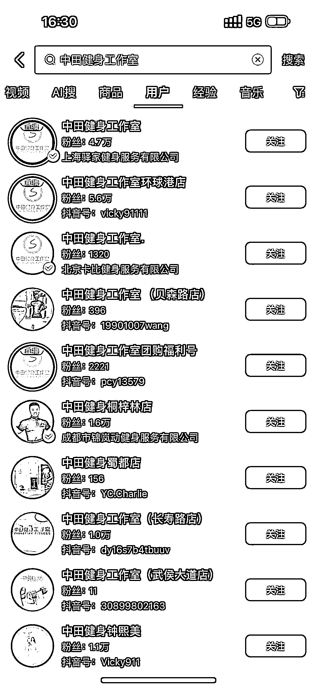
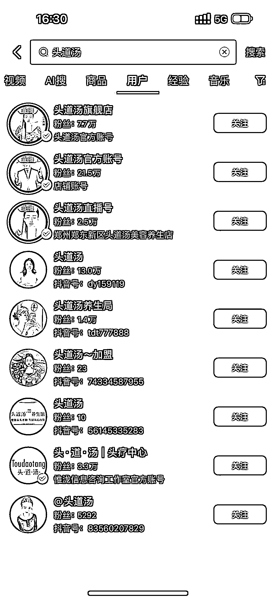
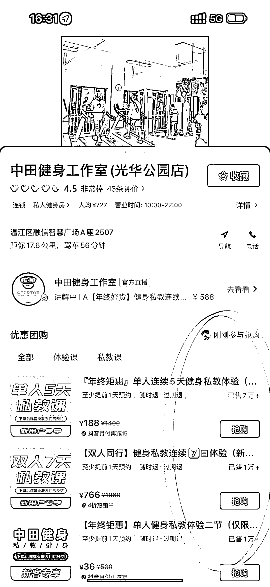

# 深度解析：用小几万撬动千万市场，创业人在抖音团购的成功之道

> 原文：[`www.yuque.com/for_lazy/xkrm14/iaxzx6rr34dmm593`](https://www.yuque.com/for_lazy/xkrm14/iaxzx6rr34dmm593)

作者： 云端行走

日期：2024-01-05

点赞数：**65**

* * *

正文：

深度解读创业人如何在抖音团购用小几万撬动千万市场 市场分析前说 3 个故事
1.朋友通过美团做烤肉饭加盟一年搞了 800 多家加盟店（他本人之前没接触过电商，主要核心打法就是做爆一个店，几百家加盟店的销量累计到一个链接）
2.身边一个头道汤圈友今年就是谈养生馆合作（店内只需要多增加一个头道汤的展牌）单店收 5000 元➕线下兑券（商家拿百分之六十），一个跑业务一个月能月入 10w+。
3.中田健身，188 元 5 节健身课，全国 1000 多个门店可用。（不到一年扩展起来的）
以上三个故事就是启发我对抖音团购深度的思考，在抖音上除了卖货就是卖项目挣钱了。如果目前是年赚千万以上，不管是卖产品还是卖项目那启动资金至少准备 100w 以上。
而我分析的这个模式你可能只需要几万或者小几十万就能做出千万营收的市场！
如果你所在的城市产品供应链不强，也就是说你卖产品这条线路走的很艰难，你有过创业经验可以研究下这种做项目的模式。
我大概说下具体操作思路(目前我们团队正在项目内测，内测完后就按照这个打法开始)
1.首先这个项目需要是服务型，就是客户得线下去兑券，利润最好能达到百分之八十。（利于达人或者商家自己直播赚佣）
2.做好知识产权的保护，因为后续所有店铺的成交都在一个链接上。（看起来数据非常吓人，利于招商和提高客户核销）
3.项目需要新奇特或者行业细分领域（参考功夫肩颈、眉毛的修养）
4.做好一个形象旗舰店（用于短视频和直播卖券，可以想象成客户在线上逛你的店，下单后去其他地方核券）
5.一定要让加盟店盈利，不能割韭菜！(拿头道汤来举例，他加盟 5000 元，每天平均要核销 10 人以上，单价 99，佣金 60%，店铺这条渠道 10 几天回本，差点的地方两三个月回本。店铺重要的是可以转化客户做其他项目，就不用和总店分润了。）
6.一定要有延伸产品，沉淀到私域。（做管道收益） 开悟的圈友祝你新年暴富！

* * *

评论区：

南极没有北极熊 : 云加盟的形式

大冲请努力 : 很多服务商干了，一年前就在玩啦～有圈友实操过有案例

悟道 : 团购云连锁

猎鲸者 : 刘杰的云家政这是这个形式吧

啊吹(不二) : 这个模式不错～

* * *

公众号搜索，懒人专属群分享