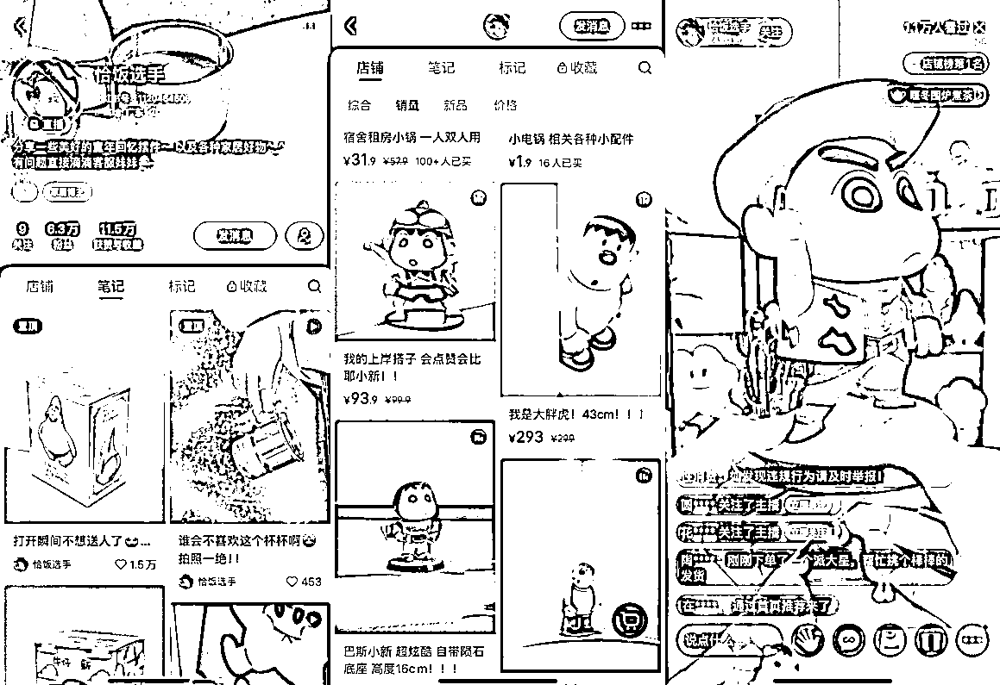
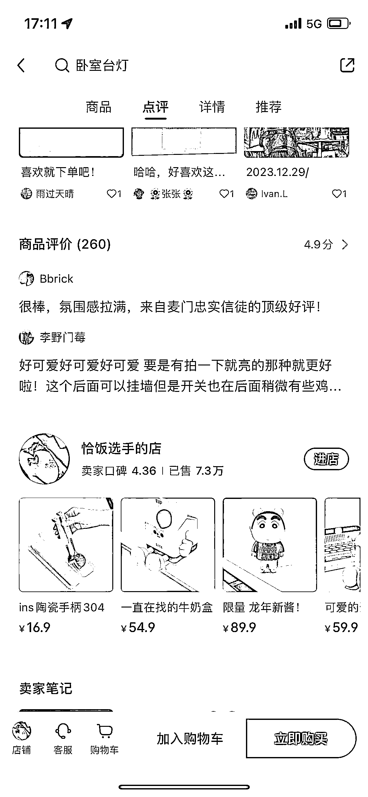

# 小红书卖轻奢摆件，7.3w 单销量突出

> 原文：[`www.yuque.com/for_lazy/xkrm14/fvk9ye4178dq5761`](https://www.yuque.com/for_lazy/xkrm14/fvk9ye4178dq5761)

作者： 六道

日期：2024-01-08

点赞数：**70**

* * *

正文：

小红书卖轻奢摆件，卖了 7.3w 单 小红书的用户群体以 25-40 岁左右的女性群体为主，对生活品质有一定的追求。
精致的家居摆件，尤其童年回忆特色主题，给人眼前一亮的感觉。 选品是核心，主打精致的轻奢路线，利润空间大。 消费降级，低价是主流，但低价赚的是辛苦钱。
小红书的用户还是能消化一批轻奢类的产品。 从直播的人货场来看，已经相对成熟，有很大的参考价值。

* * *

评论区：

* * *

公众号搜索，懒人专属群分享