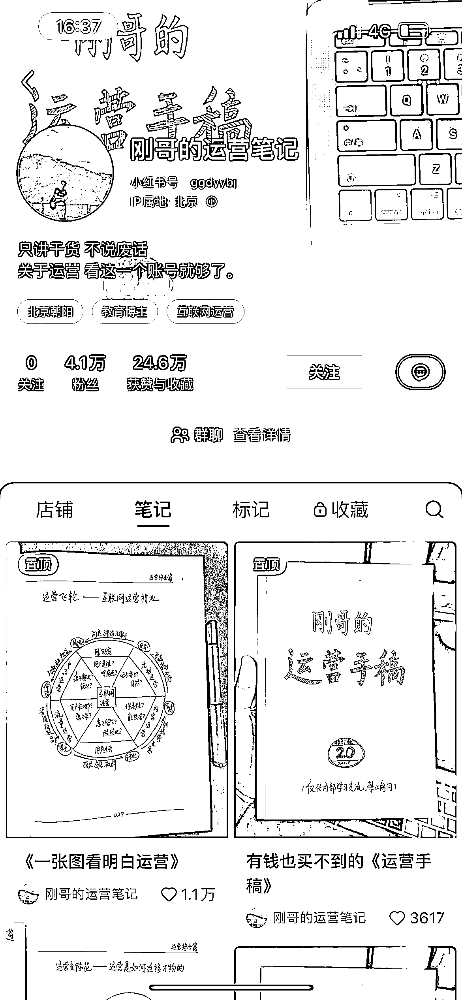
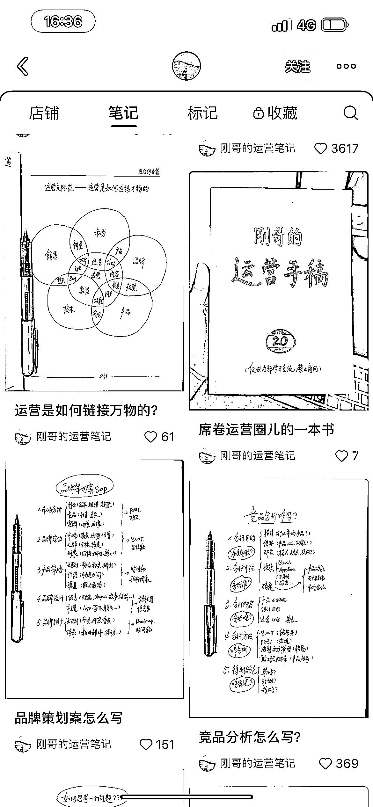
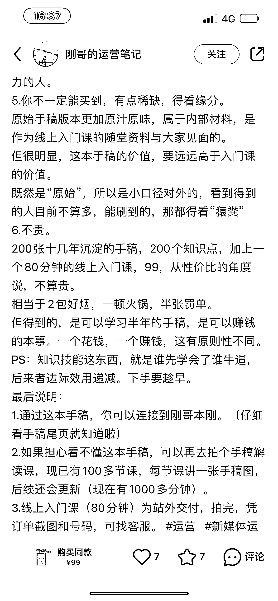
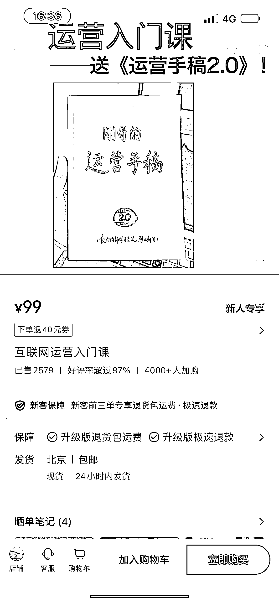

# 小红书账号成功运营笔记：手写版运营手册图片+销售文案，获利至少 20w

> 原文：[`www.yuque.com/for_lazy/xkrm14/goczhqi2hsg28y6p`](https://www.yuque.com/for_lazy/xkrm14/goczhqi2hsg28y6p)

作者： Chloe Q

日期：2024-01-10

点赞数：**73**

* * *

正文：

小红书账号：刚哥的运营笔记 账号情况：4.1w 粉丝，99 元客单价的运营视频课程，卖出了 2000+份，获利至少 20w。 账号内容：手写版运营手册图片+销售文案
异常值：手写体吸引人关注，不需要露脸出镜，发图片即可。

* * *

评论区：

蒋小兔🍑 : 好棒呀

顺利 : 优秀

浩浩 : 我前端时间买了😂

Chloe Q : 哇，那你感觉怎么样呀？如果这个博主再出新产品，会不会因为信任更愿意下单呢

* * *

公众号搜索，懒人专属群分享