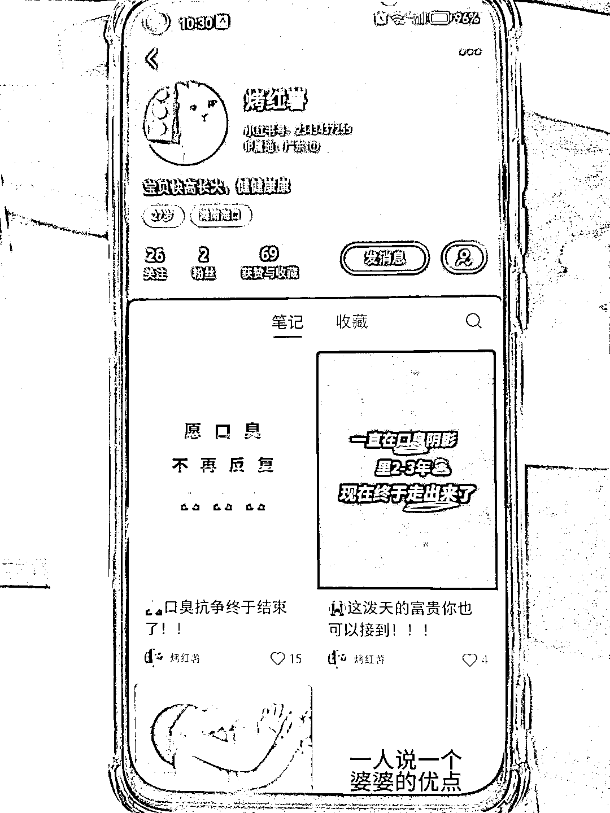
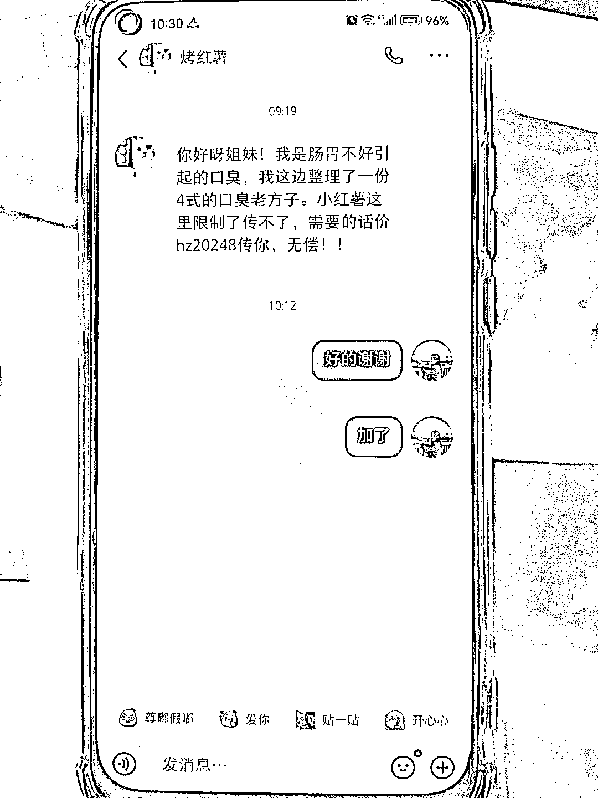
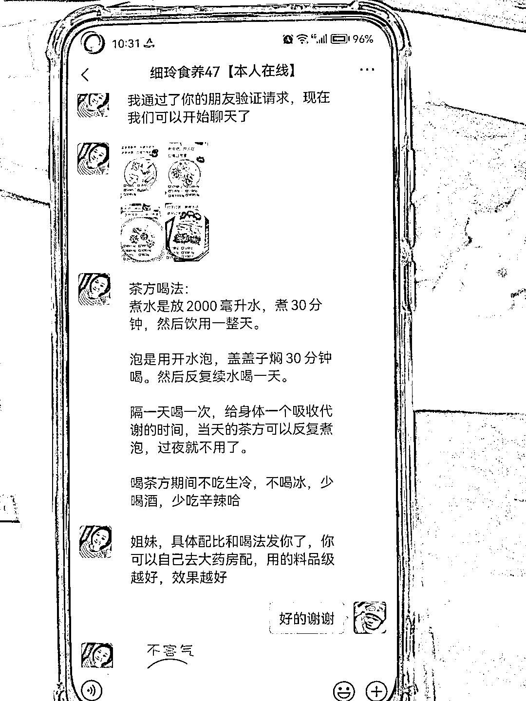
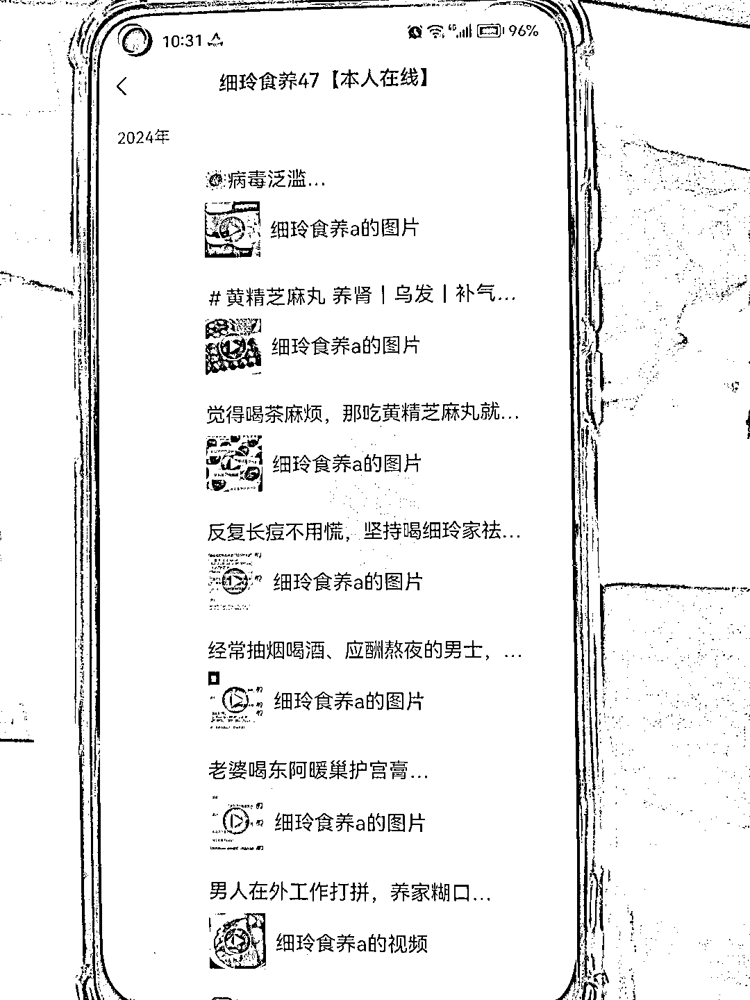

# 小红书食养引流方法，免费获取资料，粉丝精准

> 原文：[`www.yuque.com/for_lazy/xkrm14/vmt1l5dslv4zgxy8`](https://www.yuque.com/for_lazy/xkrm14/vmt1l5dslv4zgxy8)

作者： 李智

日期：2024-01-09

点赞数：**64**

* * *

正文：

小红书食养引流方法: 昨天刷小红书，点了一个赞，今天被博主发私信，无偿送资料，我被引流到微信，很丝滑。 加微信后，发现不是普通博主，微信朋友圈全是卖货。
这个账号标注 47，不出意外是第 47 个矩阵号号。 把账号发出来，有想引流的，大家可以借鉴一下，安全免费，粉丝精准。

* * *

评论区：

和光同尘 : 认识，她家一个月做 50 万营业额

HDDD : 那还挺高的

苏东皮 : 无意间刷到的嘛？

* * *

公众号搜索，懒人专属群分享