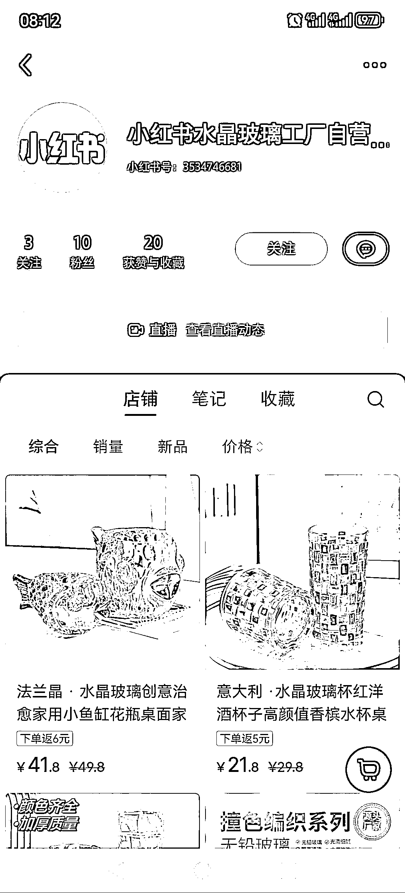
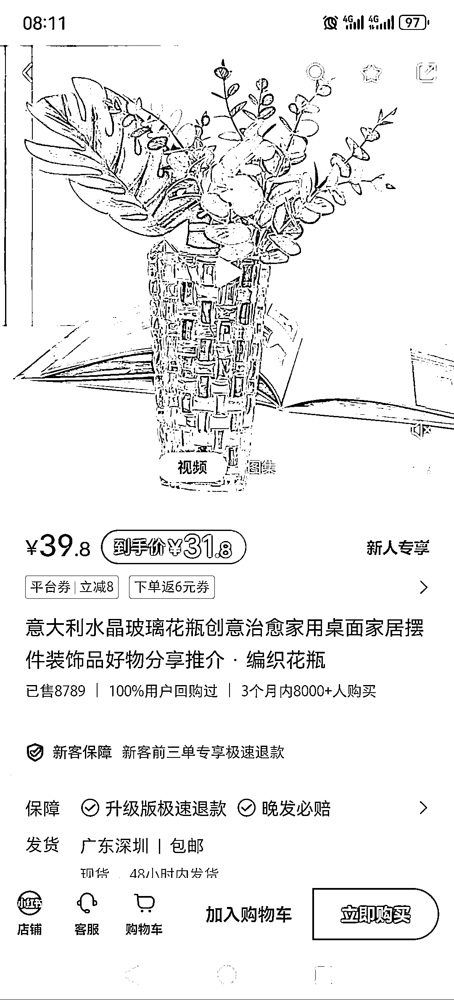
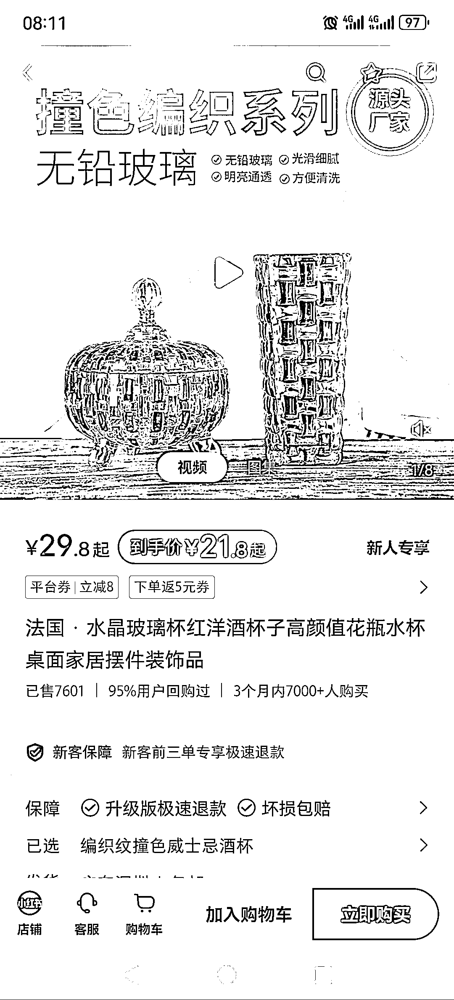
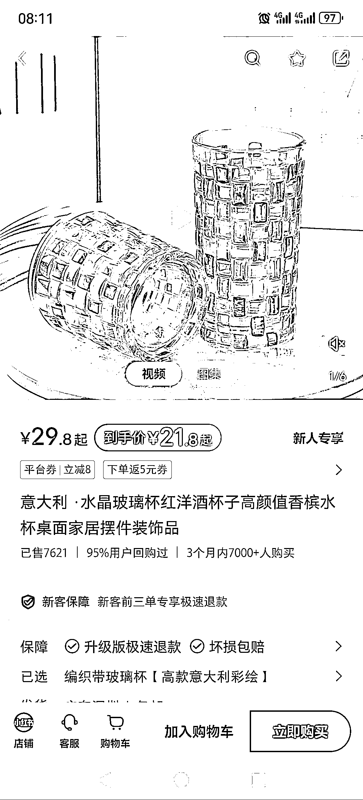
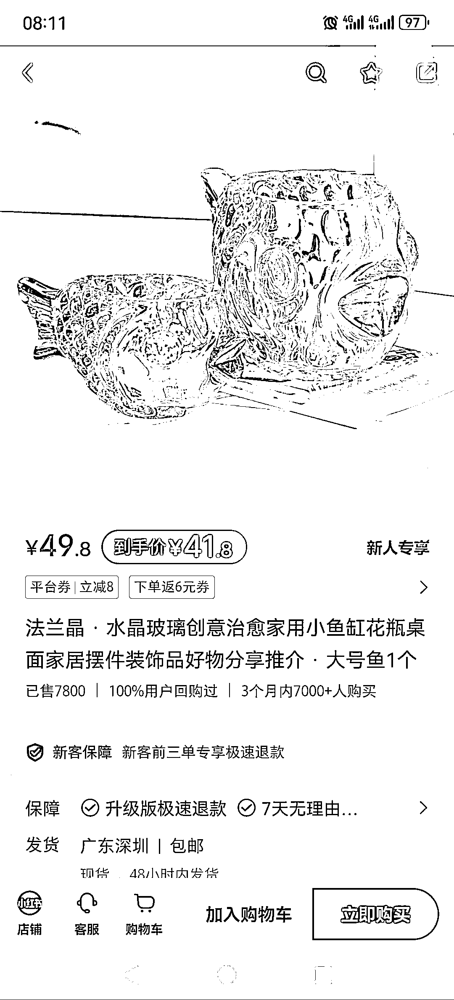
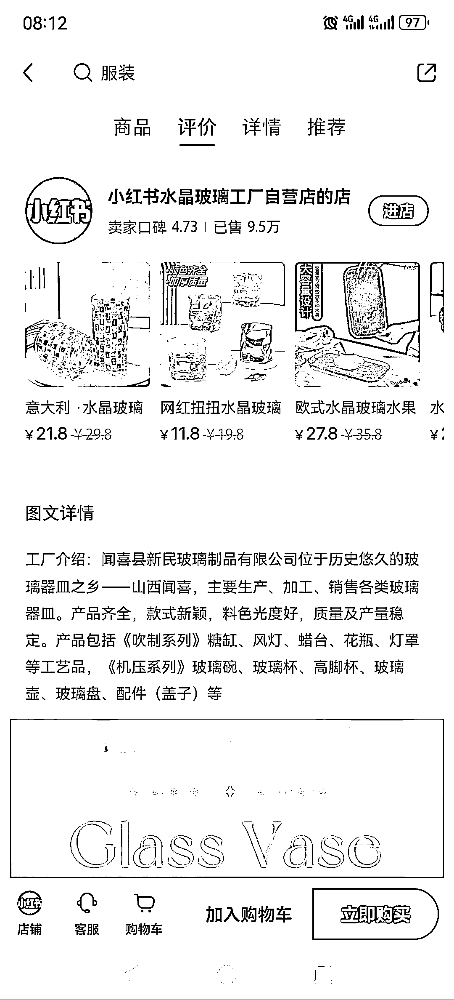
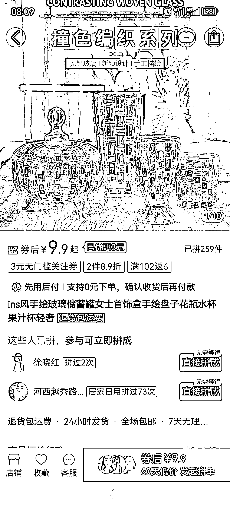

# 高颜值撞色玻璃杯，小红书热卖，回购率达 95%

> 原文：[`www.yuque.com/for_lazy/xkrm14/dpbg9vn860m7gtep`](https://www.yuque.com/for_lazy/xkrm14/dpbg9vn860m7gtep)

作者： 半阙酒

日期：2024-01-10

点赞数：**46**

* * *

正文：

高颜值产品，撞色玻璃杯 小红书卖撞色玻璃产品，博主粉丝很少，应该走的直播路线，而且走的自营路线，如果是博主笔记带货，应该可以定价更高，主打独家定制款。
看了几款撞色玻璃饰品，颜值确实高，非常适合小红书用户喜好，即可以做杯子，又可以做装饰摆件，并且回购率达到了 95%。
这几款最低产品单价 29，销售量都在 7500 之上，店铺总计已售 9.5 万件，店家其他玻璃产品也很好看。 并且这家店应该没开几个月，利润可观。
多多看了一个同款，单价 9.9，1688 批发应该更低。

* * *

评论区：

半阙酒 : 谢谢老大

* * *

公众号搜索，懒人专属群分享