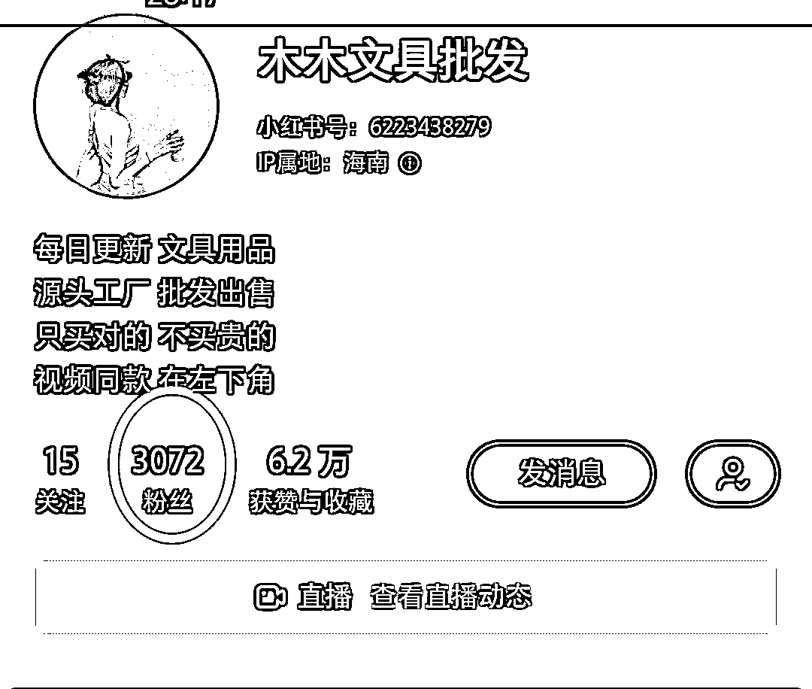
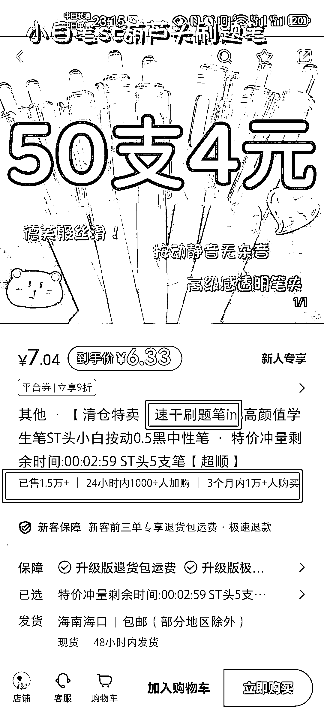
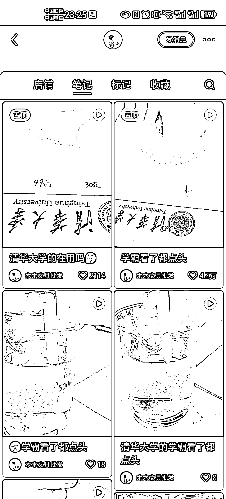

# 小红书博主靠售卖速干刷题笔赚取高销售额

> 原文：[`www.yuque.com/for_lazy/xkrm14/yddp2lgf3ygcck6c`](https://www.yuque.com/for_lazy/xkrm14/yddp2lgf3ygcck6c)

作者： 红日

日期：2024-01-08

点赞数：**32**

* * *

正文：

3000 多粉丝小红书博主，只售卖速干刷题笔这 1 个单品，不同套餐客单价在 6.33~15.98 元不等，37 天销售 1.5 万件 ，销售额 9.5~23 万不等。
博主前期做过 5 场直播卖光腿神器等裤子，12 月 1 日换赛道卖速干圆珠笔，定位于文具用品 源头工厂
批发出售，持续发视频笔记 37 天，约 80 多篇，其中一篇爆单。所有笔记只售卖速干刷题笔这个单品，视频笔记制作简单易模仿。

* * *

评论区：

JC : 回复内容

锐哥 : 牛逼，七八万块钱到手了

红日 : 有想实战这个项目的没，可以组团一起搞！

* * *

公众号搜索，懒人专属群分享