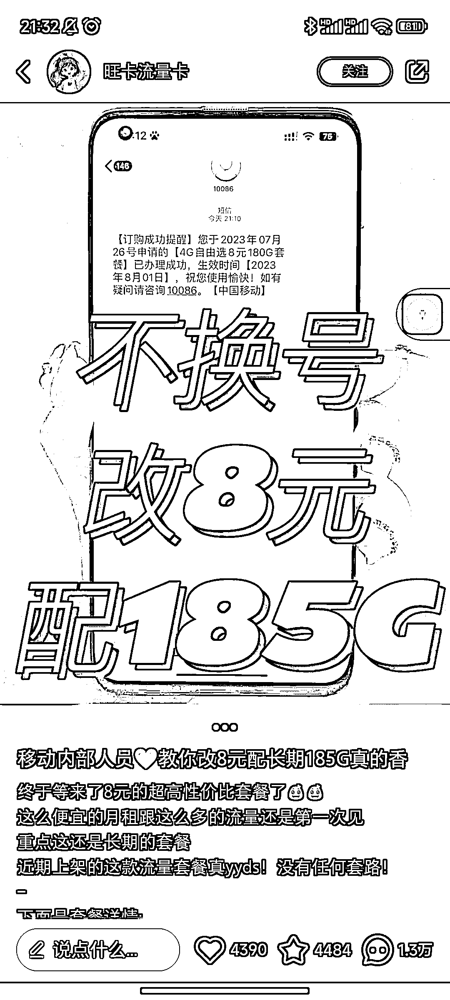
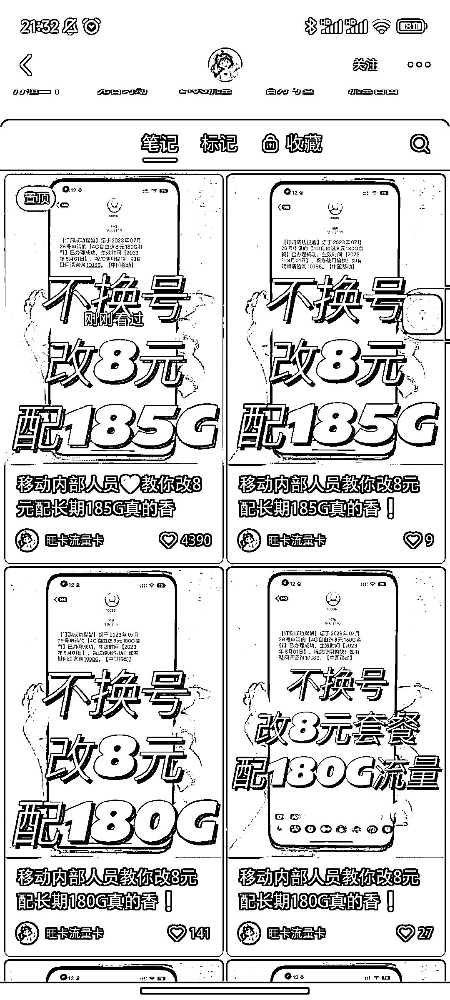
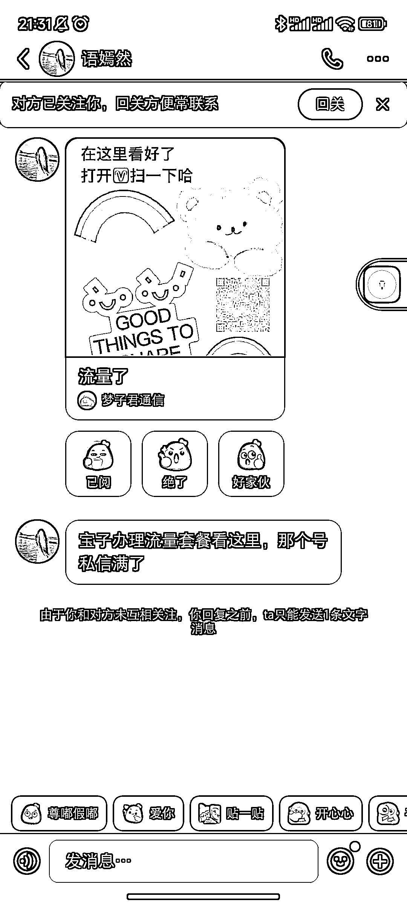
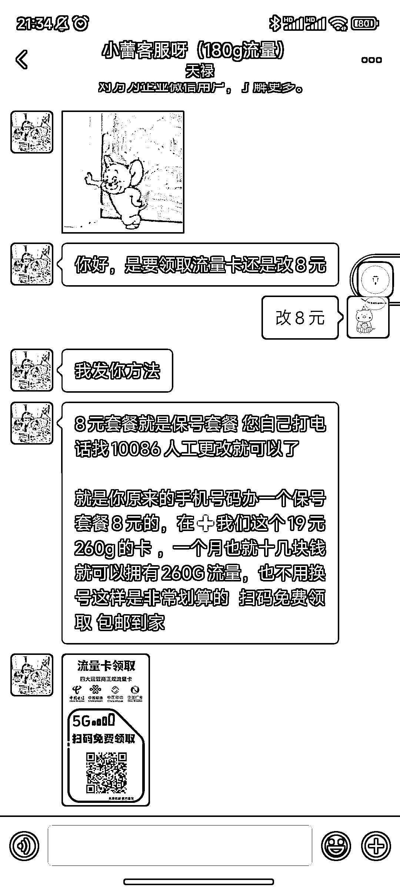

# 小红书账号推服务或产品，通过微信引流的隐私信息方式

> 原文：[`www.yuque.com/for_lazy/xkrm14/gf2tyt98rc2gghzc`](https://www.yuque.com/for_lazy/xkrm14/gf2tyt98rc2gghzc)

作者： 朱声声 _Sharon

日期：2024-01-08

点赞数：**24**

* * *

正文：

一个办卡的小红书账号，所有的图文内容差不多，图片差不多，其中一个爆了，是一个推服务或产品的思路！
加微信的隐私信息是通过另外一个小号先关注你的账号，给你发私信，图片上带有不清晰二维码，但不影响扫码，一个留微信的方式。
加了微信之后，提供的服务并不是直观理解的 8 元 180G，而是改 8 元为运营商的保号服务，再购买 19 元的流量卡，看着也还行，差点就入套了！也是个公域到私域引流的方法！

* * *

评论区：

趁天亮浓雾里透着光 : 为什么一样的图她可以重复使用，我的就违规[撇嘴]

* * *

公众号搜索，懒人专属群分享