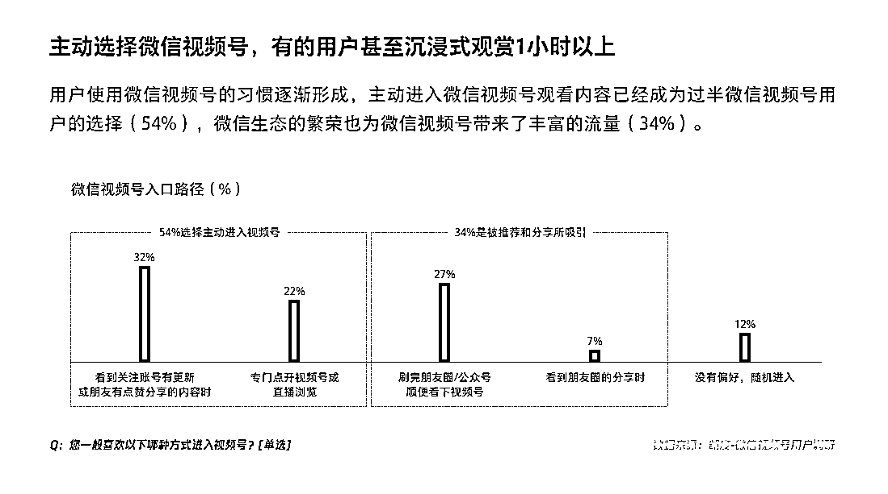
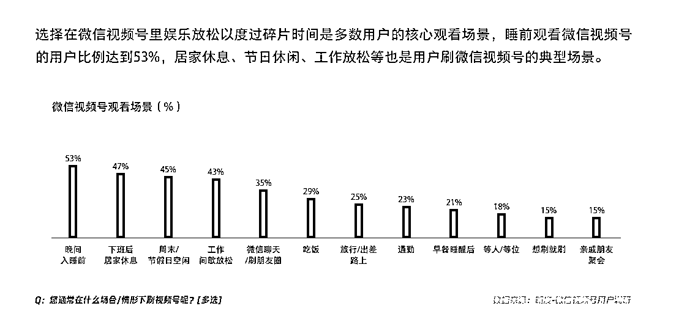
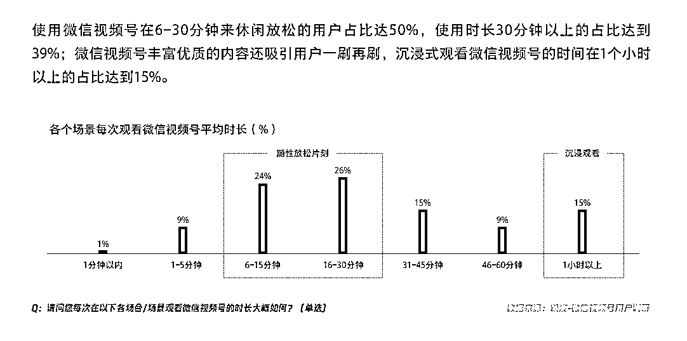
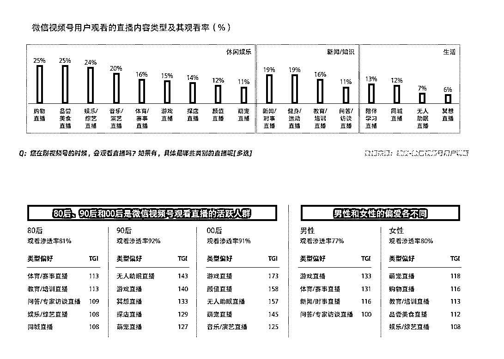

# 2024 年微信视频号的关键数据揭示用户观看习惯和喜好

> 原文：[`www.yuque.com/for_lazy/xkrm14/tlp3w71s5lb8zeq0`](https://www.yuque.com/for_lazy/xkrm14/tlp3w71s5lb8zeq0)

作者： 张波

日期：2024-01-10

点赞数：**44**

* * *

正文：

2024 年如果想要做好视频号，可以重点关注下面的数据：
用户使用微信视频号的习惯逐渐形成，主动进入微信视频号观看内容已经成为过半微信视频号用户的选择(54%)，微信生态的繁荣也为微信视频号带来了丰富的流量
(34%)。
选择在微信视频号里娱乐放松以度过碎片时间是多数用户的核心观看场景，睡前观看微信视频号的用户比例达到 53%，居家休息、节日休闲、工作放松等也是用户刷微信视频号的典型场景。
在微信视频号，直播成为了一种陪伴，用户喜爱观看围绕生活方方面面的休闲娱乐直播内容。购物带货、品尝美食和娱乐综艺等直播主题是微信视频号用户的最爱。80 后、90 后和 00 后是微信视频号观看直播的活跃人群，他们在这里看体育赛事、教育培训、专家访谈、娱乐综艺、探店、萌宠、音乐演艺等多种类型的直播内容。

* * *

评论区：

* * *

公众号搜索，懒人专属群分享