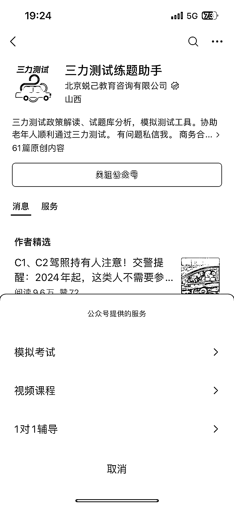
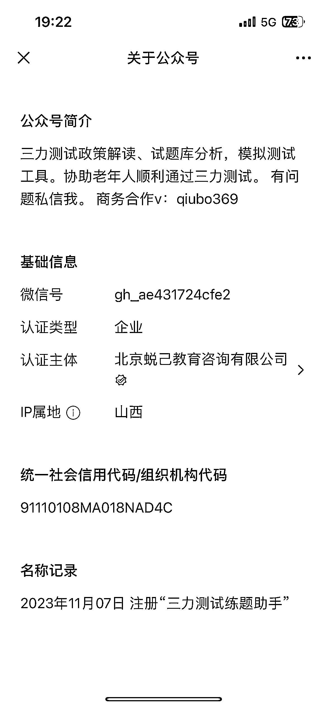
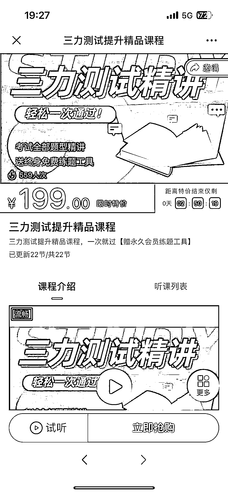
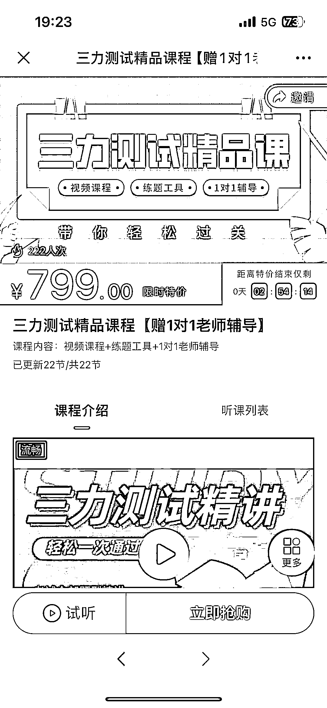
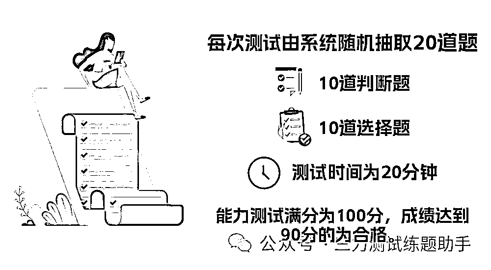
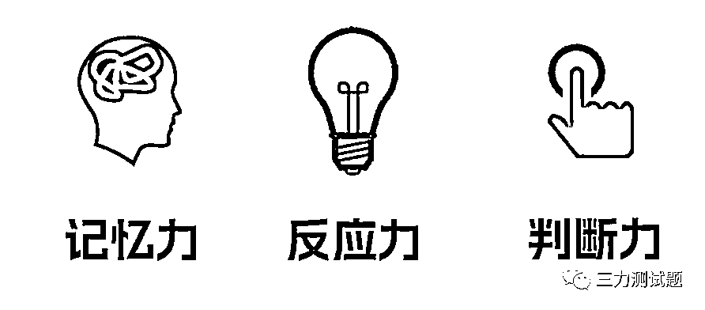
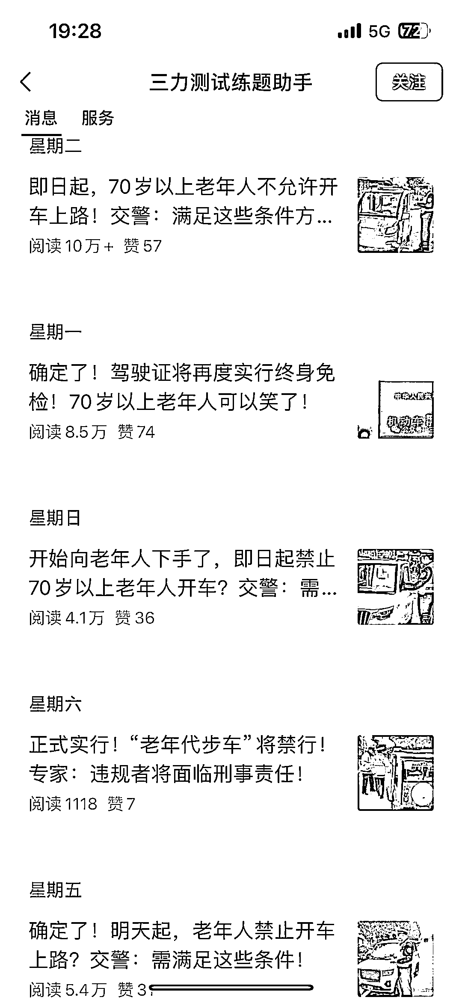
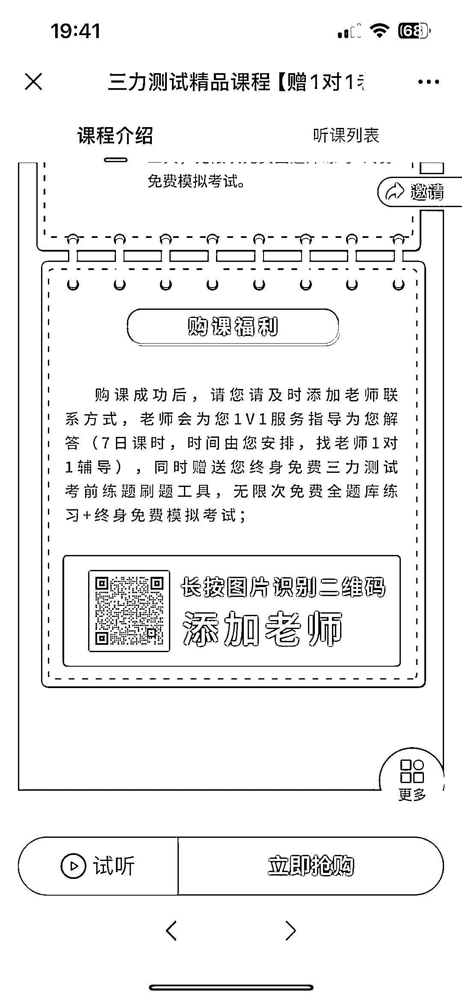

# 老年三力测试题辅导引爆爆款，公众号业务大卖课

> 原文：[`www.yuque.com/for_lazy/xkrm14/dx3bgawrgyqcyusb`](https://www.yuque.com/for_lazy/xkrm14/dx3bgawrgyqcyusb)

作者： Elsa🍀

日期：2024-01-11

点赞数：**52**

* * *

正文：

11 月 7 开的号，主要做老年三力测试题辅导，文章出现爆款的频率很高，公众号业务有引流和卖课 单价 199 的录播课卖了 559 份
单价 799 的含一对一辅导，222 份，且一对一是 7 日课时 文章的内容解释三力定义和题型，再加交规的解释，写起来不难

* * *

评论区：

波叔 : 之前也看到过的

* * *

公众号搜索，懒人专属群分享