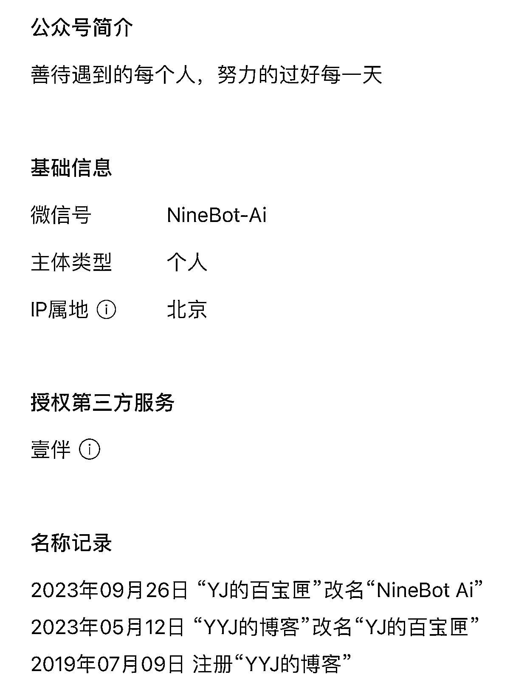
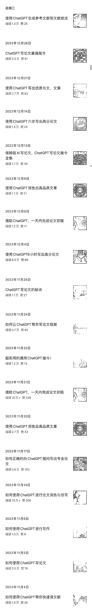
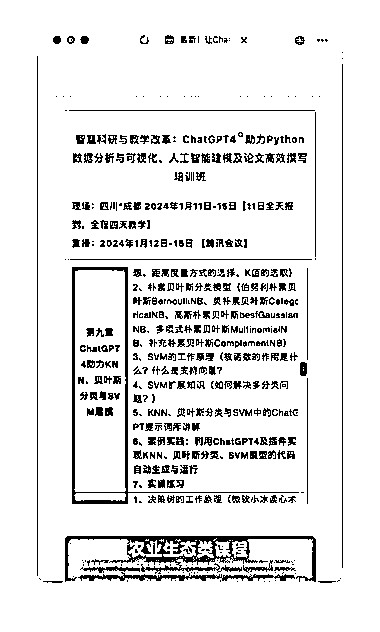
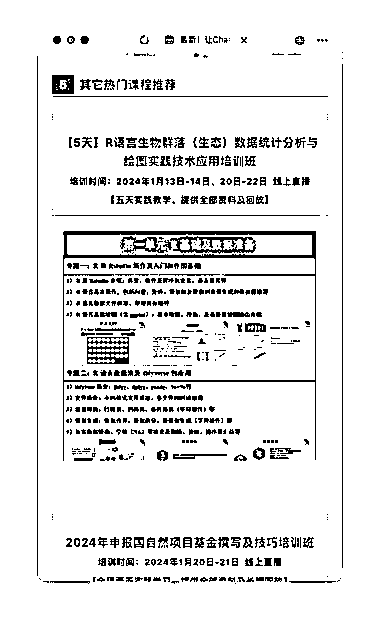

# AI 主题公众号以科研工作者为目标读者，不到 6 个月时间已出现多篇爆款

> 原文：[`www.yuque.com/for_lazy/xkrm14/dr1p47cet6awd0lc`](https://www.yuque.com/for_lazy/xkrm14/dr1p47cet6awd0lc)

作者： 林林 AIGC 写作

日期：2024-01-08

点赞数：**36**

* * *

正文：

以科研工作者作为目标读者的 AI 主题公众号，不到 6 个月时间已出现了多篇爆款。其中不乏“10 万+”。
这个公众号停更了 4 年多，直到去年 9 月底管理员才改名，决定做一个 AI 领域的垂直公众号。具体来看这个账号的推文，其中大多数都是关于如何使用 AI 工具提升科研工作者的公众效率。尽管这类人群在微信庞大的用户基数中尚属少数群体，但是照样能够写出“10 万+”。同时这个账号的管理者也很有商业意识，他在最近也开始在推文中销售相关的付费课程。
看来“AI+精准人群”在未来一直会是公众号爆文写作、知识付费的一个不错的方向了。

* * *

评论区：

* * *

公众号搜索，懒人专属群分享