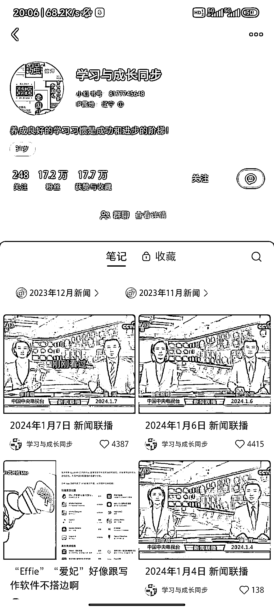
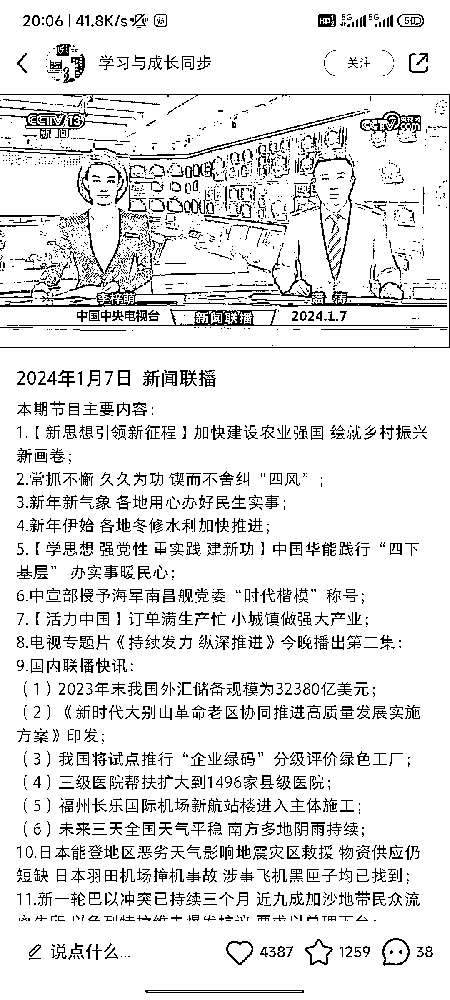
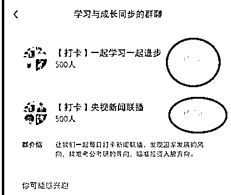
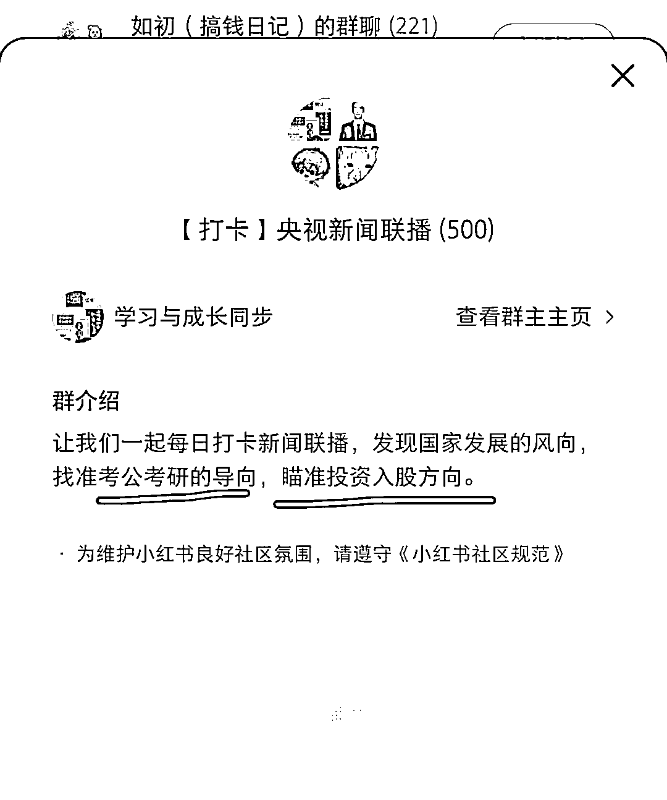
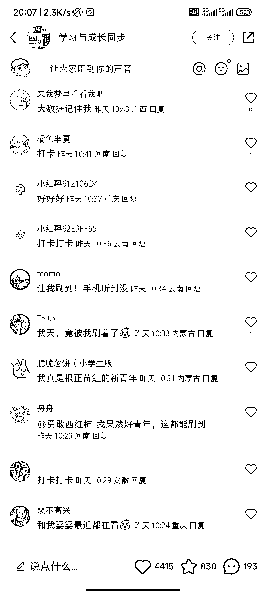
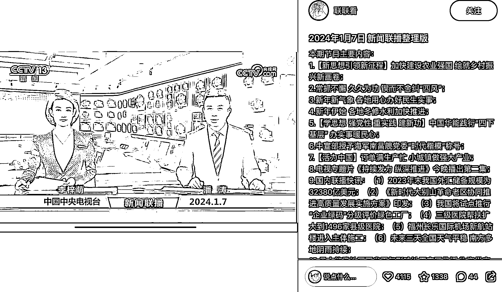

# 利用 AI 总结新闻联播，打造个人号，适合考公和投资粉丝

> 原文：[`www.yuque.com/for_lazy/xkrm14/fbpfb23q6kkf69ai`](https://www.yuque.com/for_lazy/xkrm14/fbpfb23q6kkf69ai)

作者： 晓俊 Ocean

日期：2024-01-08

点赞数：**33**

* * *

正文：

搭配 AI 总结下每日新闻联播也能做个号？做考公/投资粉的可以参考。 公域->群转化->私域->考公资料/培训/投资转化

* * *

评论区：

威曹 : 不需要 ai 总结，学习强国 app 里面有这个内容，直接照搬的

* * *

公众号搜索，懒人专属群分享