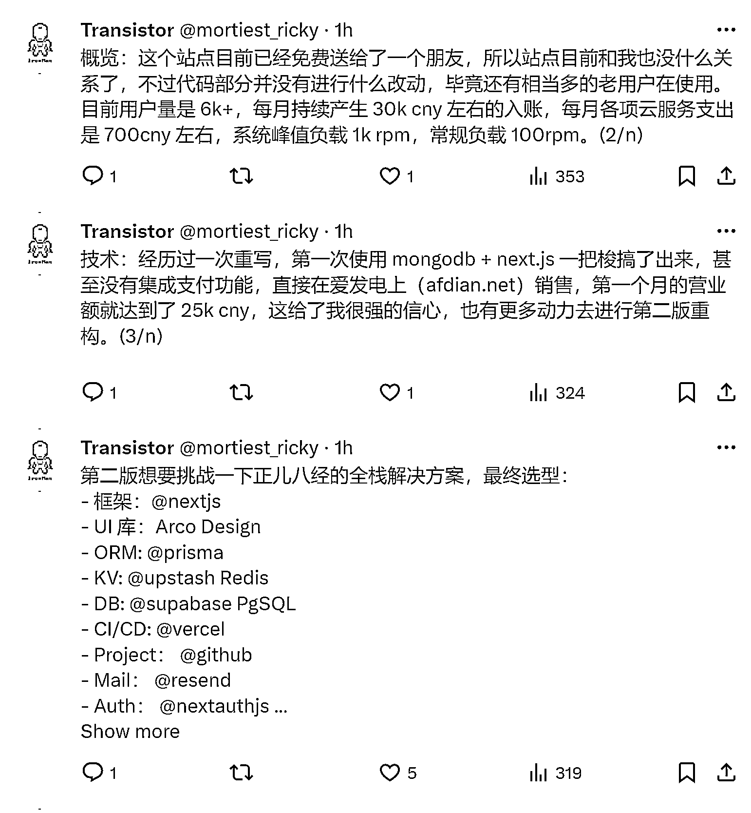
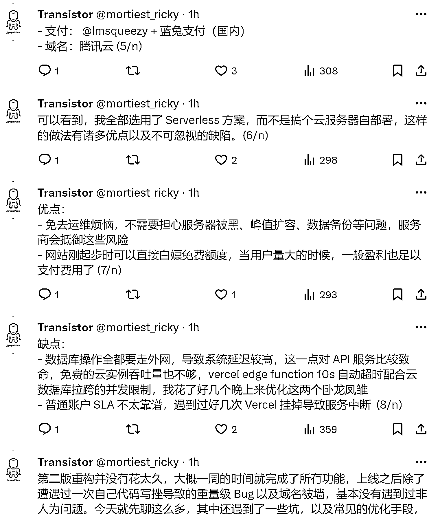

# ChatGPT Next Web 作者分享站点技术栈

> 原文：[`www.yuque.com/for_lazy/xkrm14/eu05sg2z803gahh4`](https://www.yuque.com/for_lazy/xkrm14/eu05sg2z803gahh4)

作者： 橘子小姐

日期：2024-01-09

点赞数：**25**

* * *

正文：

ChatGPT Next Web 作者分享了他的站点所用技术栈。这个站做的事情也比较烂大街，主要解决他在做 ChatGPT 开源套壳项目的用户的 API
使用问题，说白了就是 API 中转站。

* * *

评论区：

大龙 dylan : 开源吸引流量+增值服务的模式

* * *

公众号搜索，懒人专属群分享