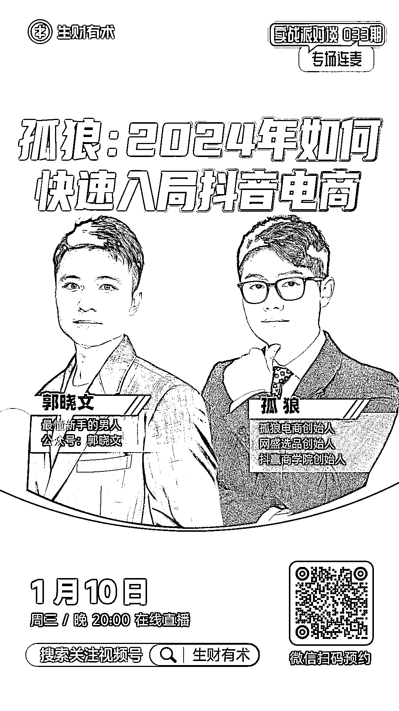
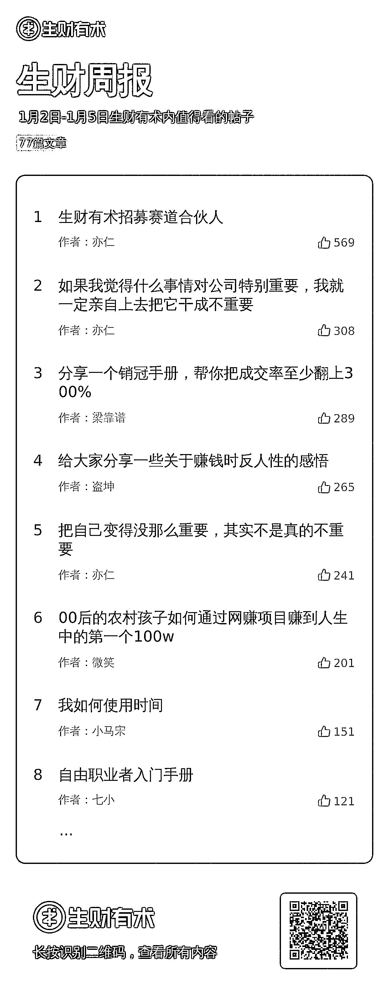
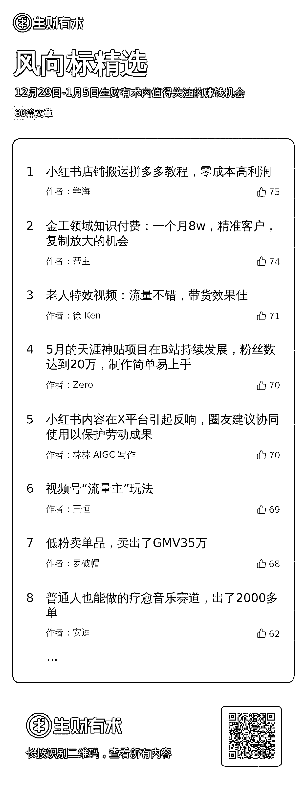

# 【生财周报】（0102-0105）

> 原文：[`www.yuque.com/for_lazy/xkrm14/fmlw00grkbs1qmpw`](https://www.yuque.com/for_lazy/xkrm14/fmlw00grkbs1qmpw)

作者： 杨爽@生财有术

日期：2024-01-08

点赞数：**85**

* * *

正文：

新的一周开始了，又是我，杨爽，给我的周报股东们汇报一下上周进展。 快过年了，按照生财的惯例，年底总要做点啥： ·
去年会员日和圈友们一起回顾了一下“过去一年，大家是怎么使用生财有术的”； · 22
年过年前的那个会员日，我们决定开始内容视频化，有 1200 多个圈友留下了自己的口播短视频； · 21 年，我们提出要完成 2021
年收入翻倍，你需要做的最重要的三件事是什么？如果大家感兴趣不妨去原帖下面看看，有多少经验放到今天依旧适用； ……（再往前我还没来，我就不回溯了）
今年过年，大家有啥想法不？都是自己人，别客气。 我们目前已经开始搞的事情有： 赛道合伙人
开启招募，亦仁的原话是“我们一起成为十年以上的合伙人，尝试做一些有利于他人，有利于社会，最终也会有利于我们自己且很好玩的事情”，如果你也感兴趣的话，不妨联系亦仁聊聊；
项目拆解
专栏正式上线，在风向标、中标之后，不少圈友反馈有一种脱节的感受：“看不懂”、“不知道是不是真的有机会，到底能不能做"、“觉得有机会但不确定具体能做点什么”……
通过项目的深度拆解，希望帮大家理解项目背后的逻辑，前两期试运行的效果真的很不错，如果你还不知道如何判断一个项目是不是有机会，有什么样的机会，项目拆解后可能你会找到新的思路；
好啦，那老规矩，还是给大家讲讲【值得看的内容】和【不容错过的星球活动】； 【值得看的内容】 先承认一下，上周加精速度确实慢了，至于为什么，嗯，我不说。
1、从 0 做一家小而美的宠物外卖店 热门宠物赛道+美团闪电仓外卖配送模式，在一二线年轻人多的城市，相对比较有机会，可以做到月销 1000+
单；如果你没有宠物店基础，圈友 从 0 开始搭建外卖店 sku，选品选址的过程，都可以作为你快速入局的经验参考。 2、月入 20w 的小红书引流获客思路
小红书潜在的垂类机会依旧值得关注，夫妻搭档做小学到初高中的英语培训，通过小红书月入 20 万。 圈友 关于小红书运营有不少值得大家参考的新知： ①
关于小红书账号运营，发的多比发的好重要，通过数量找对方向； ② 关于小红书投放，利用聚光投放跑量，既可以避免被封，又大大降低获客成本； ③
利用兼职来做矩阵，降低用人成本，进一步降本增效。整体小红书运营思路简单但有效，适用于各种类目的引流，大家看完说不定对自己的业务会有不小的启发。
3、设计师怎么靠小红书赚钱？
设计师在小红书做号的心得分享，比如要以变现为目标去做内容；比如利他类内容，在小红书容易爆；比如不同的变现模式……帮助大家对账号怎么做起来的有更深入的了解。
不仅如此，圈友 还分享了一些踩坑经验分享，单平台流量的不稳定，讲课平台的暴雷等，希望大家看完有新的收获。 另外，【不容错过的星球活动】 1、航海活动：
上周，航海正式开船了，如果你在船上，希望不久后能听到你的好消息；如果你没赶上这次的航海，那关注好星球，年后的第一次航海活动一定不要再错过了； 2、线上直播：
这周的直播厉害了，我们邀请了被电商耽误的艺术家孤狼老板，来聊聊《 2024 年如何快速入局抖音电商》。
除了源头工厂供应链直播落地的电商经验，今年在一线城市同城服务也取得了千万成绩，生财访谈官 和生财实战家 的对话，一定不能错过，抓紧预约； 3、线下活动：
“合则有术，聚能生财”，北京年会在上周末正式落下帷幕了。 在现场大家一起看表演，玩游戏，听嘉宾分享，对 2023
做个总结，开始迎接新一年的机遇与挑战，年底了，不妨见见这群生财老友。 点击链接，即可报名：（目前只支持手机微信端）
最后，送上完整的星球活动和星球内容给大家！ 【生财周报】 本周值得看的帖子已收录 77 篇，点此链接即可查看： 【风向标】
本周值得看的风向标，点此即可查看按类分好的风向标： 也可以点击 标签直达。 好啦，新一周祝大家身体健康、生财有术！[生财有术·精华帖索引工具 2.0](https://search01.shengcaiyoushu.com/mobile/activity/formList) [1 月 2 日-1 月 5 日生财有术内值得看的帖子](https://i.shengcaiyoushu.com/collection?id=IfRPIfiM) [12 月 29 日-1 月 5 日生财有术内值得关注的赚钱机会](https://i.shengcaiyoushu.com/collection?id=IfRPIxhM) 

* * *

评论区：

波叔 : 666

* * *

公众号搜索，懒人专属群分享