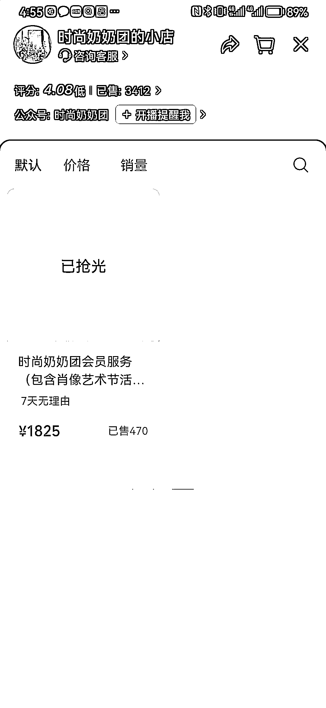
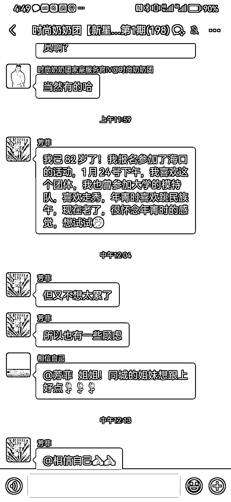
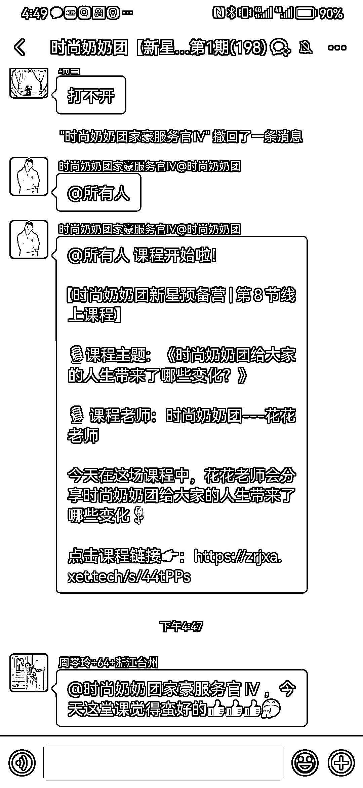
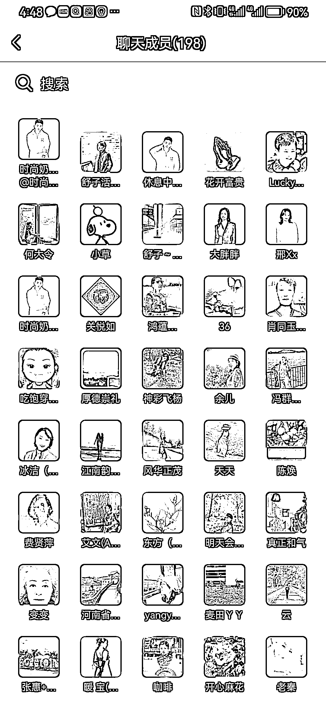

# 老年人市场的线上课程销售成功案例及变现思路分析

> 原文：[`www.yuque.com/for_lazy/xkrm14/lg20lr8vctcy9nkd`](https://www.yuque.com/for_lazy/xkrm14/lg20lr8vctcy9nkd)

作者： 静香也有点东西

日期：2024-01-10

点赞数：**70**

* * *

正文：

项目拆解 1.客单价 4 位数的线上课程，为老年人体态化妆走秀等，一场直播销量非常好.老年人也非常热情。成交变现也不错
2.他们的私域群里面，客户也很热情，有钱也是真有钱！ 3.变现思路也比较直接，参加线下活动，线上课程。
4.偷偷进去他们的客户群，发现他们的用户画像非常精准，爱美老年女性，且都是退休了而且素质较好的老年女性，有消费能力，且想完成年轻时候的梦想。这个需求是真需求不是臆想出来的。
5.这个品牌是 20 年注册的，且有一定的品牌效应，那么如果想做这方面的生意我们没有品牌效应的时候，该如何低成本的下场？ 欢迎一起来探讨！

* * *

评论区：

静香也有点东西 : 感谢亦仁大大认可，第一次中标，好激动！

胖大魔 : 他们是头部

* * *

公众号搜索，懒人专属群分享