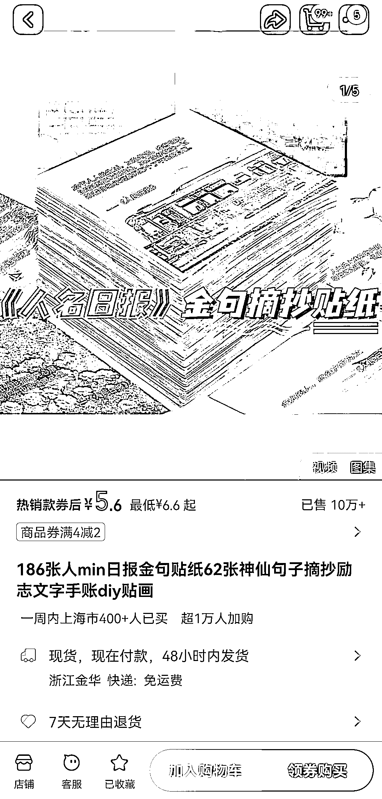
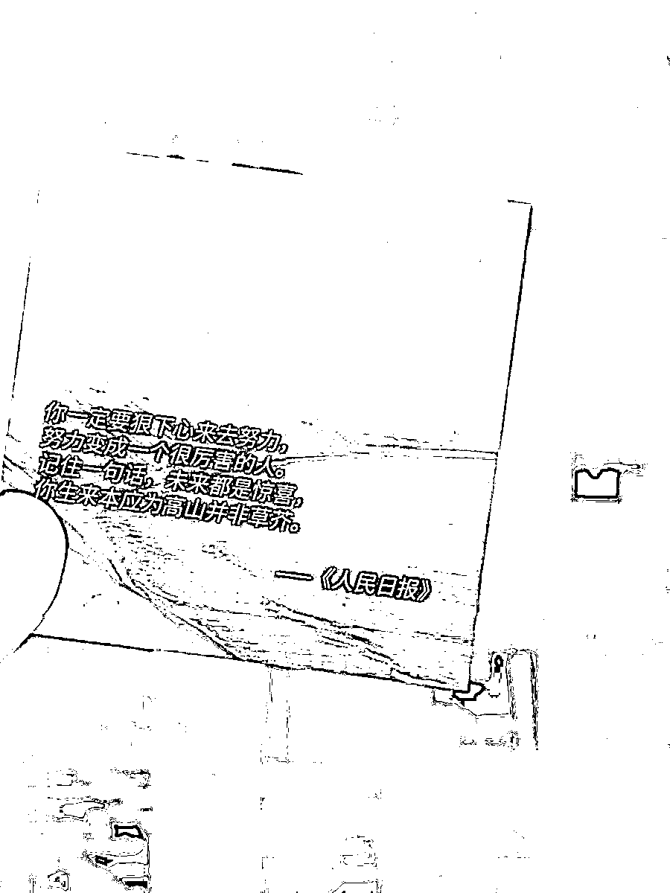
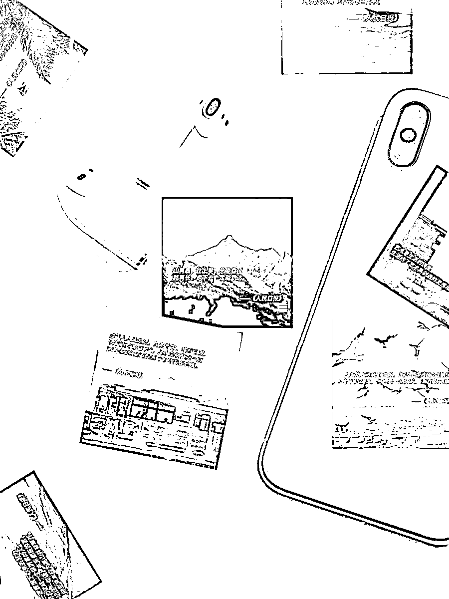
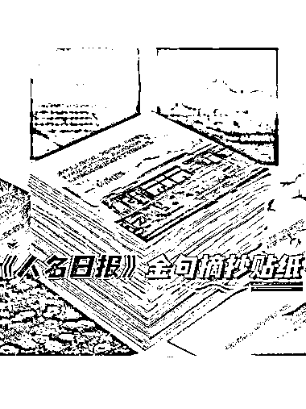

# 人民日报金句贴纸：热销 10 万+，满足学生和体制内群体需求

> 原文：[`www.yuque.com/for_lazy/xkrm14/kaecnrg2pwpwxo8u`](https://www.yuque.com/for_lazy/xkrm14/kaecnrg2pwpwxo8u)

作者： 元夕

日期：2024-01-09

点赞数：**72**

* * *

正文：

人民日报金句贴纸 一单 5.6，已售 10 万+。
之前只知道金句类的做成电子版方便，没想到实体贴纸需求还这么大。这类金句可以面向学生和体制内群体。当然，内容不一定来自人民日报，很可能是网上搜集的金句，安上人民日报的名头而已。
类似的可以拓展一下，做一个写作材料金句合集，面向体制内需要写材料的那些人。以及可以像之前风向标提到用飞书多维表格制作“记账应用”一样，制作类似的“金句应用”

* * *

评论区：

阿勾 : 很有意思，感觉做成日历台历什么的也会有市场。

* * *

公众号搜索，懒人专属群分享