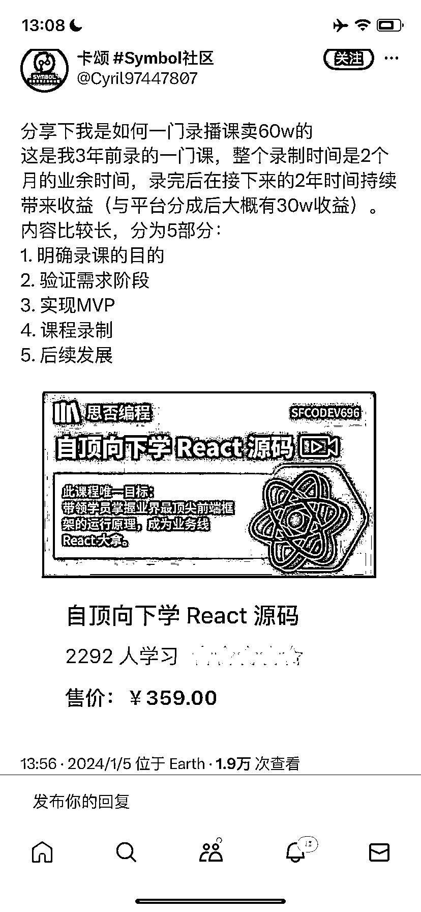
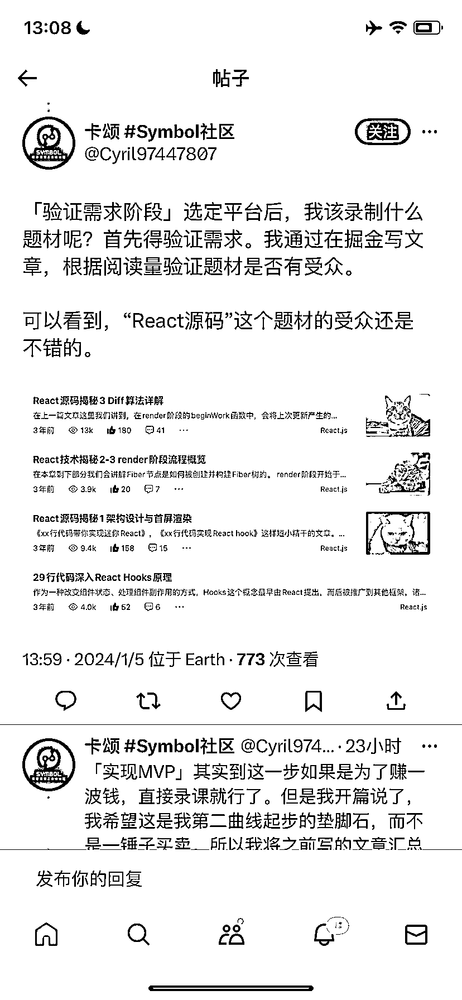
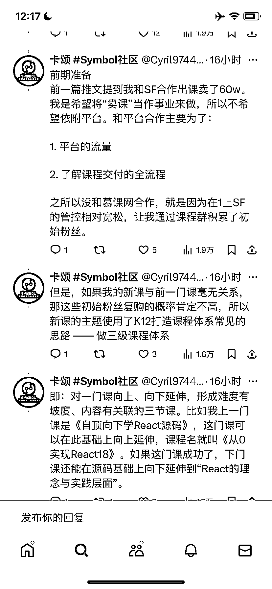
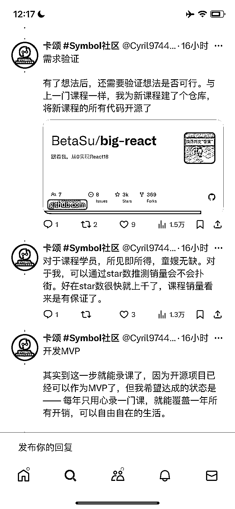
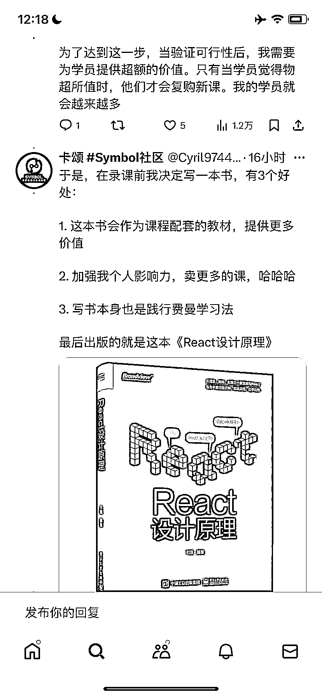
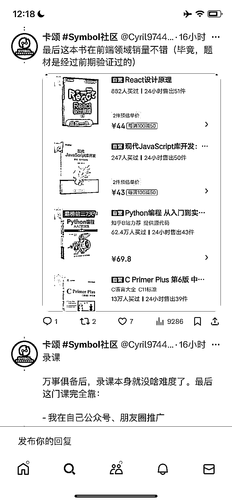

# 3 年时间，一门录播课平均每年带来 10W 收益

> 原文：[`www.yuque.com/for_lazy/xkrm14/cktyftubtm5r4gzx`](https://www.yuque.com/for_lazy/xkrm14/cktyftubtm5r4gzx)

作者： 罗破帽

日期：2024-01-09

点赞数：**50**

* * *

正文：

【3 年时间，一门录播课平均每年带来 10W 收益】 a.整个录制时间是 2 个月的业余时间，录完后在接下来的 2 年时间持续帯来收益。
b.作者分享了他从有想法——验证需求的的过程，对程序员朋友应该有启发！

* * *

评论区：

若虚 : 请问这个是那个 app？

* * *

公众号搜索，懒人专属群分享