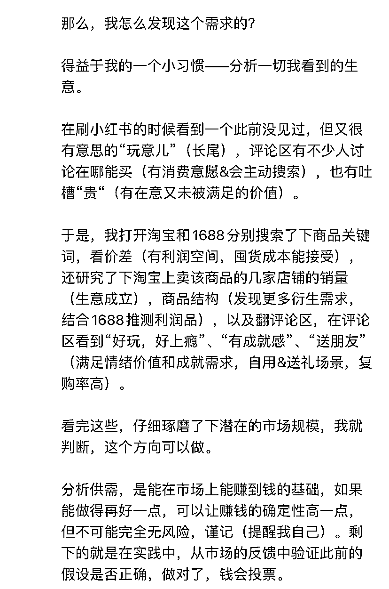
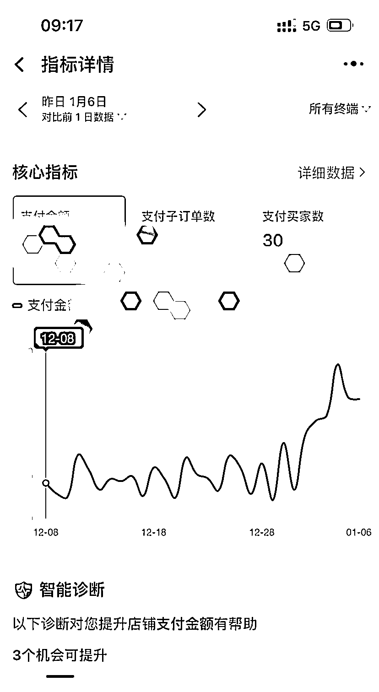

# 从发现到验证：挖掘长尾精准需求，订单量翻倍

> 原文：[`www.yuque.com/for_lazy/xkrm14/ygydgrg8z6v5cu2t`](https://www.yuque.com/for_lazy/xkrm14/ygydgrg8z6v5cu2t)

作者： 罗破帽

日期：2024-01-08

点赞数：**44**

* * *

正文：

a.博主分享了他开淘宝店，不花钱投流，靠长尾词让销量翻一番的过程。 b.从发现长尾精准需求——挖掘长尾精准需求——验证思路，最后订单量比之前翻了一番！

* * *

评论区：

80G 先生 : 想看原文[害羞]

罗破帽 : 这个是原文哈[呲牙]

* * *

公众号搜索，懒人专属群分享