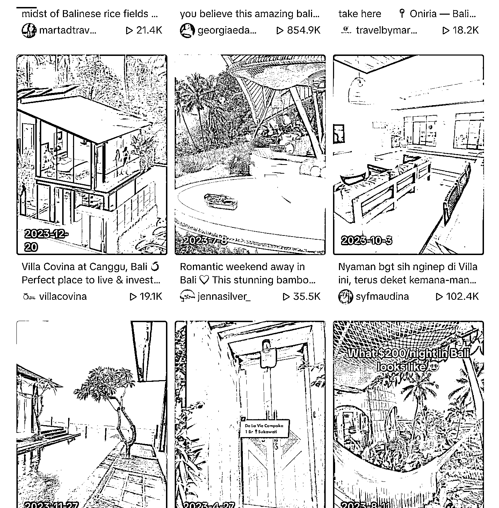
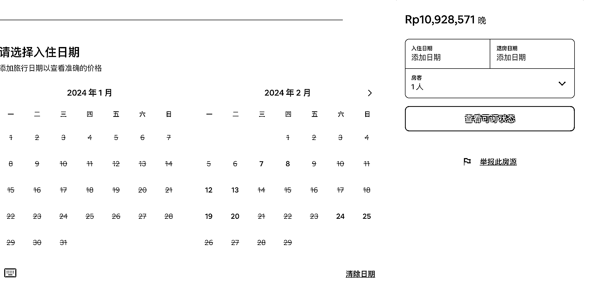

# 热门旅游地区开民宿，设计场景创新是最大门槛

> 原文：[`www.yuque.com/for_lazy/xkrm14/gq6ndw3r0zrklzit`](https://www.yuque.com/for_lazy/xkrm14/gq6ndw3r0zrklzit)

作者： Kali

日期：2024-01-09

点赞数：**41**

* * *

正文：

热门旅游地区开民宿。近期在巴厘岛当数字游民，感受到这里有钱人真的太多了，好多亿万富翁，一晚上几千几万的酒店民宿。我自己也想开一个民宿，我感觉开一个民宿最大的门槛，是设计场景创新。
看了 tiktok 和 ig 上很多热门的酒店，其实官方账号自己营销成本并不高，因为这种酒店卖的新奇特场景自带流量。一个场景火成大爆款，就能养活自己 10 年了。
但现在这些场景已经同质化了，所以现在要做的话，得在这个基础上做点创新，再创一个品类第一。 在国外开民宿的话，还要考虑背后的政策和关系网。

* * *

评论区：

林林 AIGC 写作 : 你也开一家哈哈哈

Kali : 是滴哈哈哈想！

波叔 : 2024 旅游会比 2023 更火，特别是近期的西哈 CP，已经开始全国联动了

🚁 柯伊伯🚁 : 打算在巴厘岛开民宿吗？

* * *

公众号搜索，懒人专属群分享