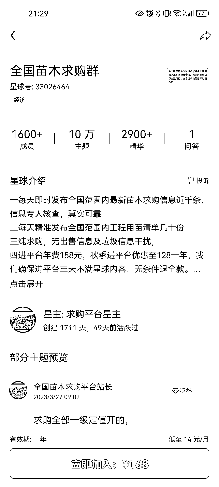

# 垂直领域星球“苗木求购”：资源交流群和下沉市场建设

> 原文：[`www.yuque.com/for_lazy/xkrm14/ikvx5ytwcgwn3ylr`](https://www.yuque.com/for_lazy/xkrm14/ikvx5ytwcgwn3ylr)

作者： Daemon

日期：2024-01-10

点赞数：**45**

* * *

正文：

垂直领域星球“苗木求购”星球 可以建立一个垂直领域的资源交流群，全是对于苗木有需求的
另外在星球基础上，可以通过销售渠道建立苗木的下沉市场是，例如如何喂养苗木，苗木修剪等延伸需求

* * *

评论区：

* * *

公众号搜索，懒人专属群分享