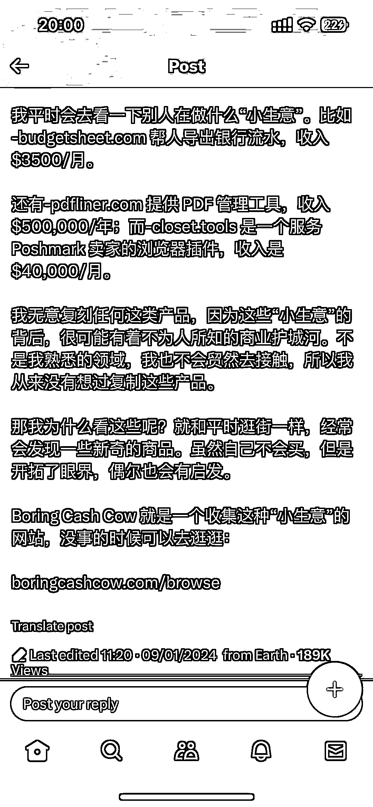
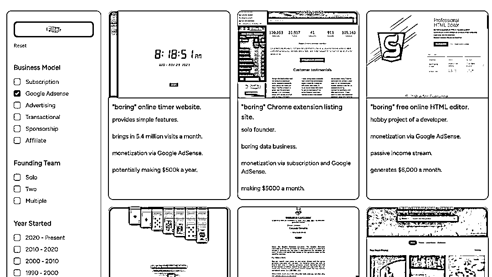

# boring cash cow：一个集合了多个 niche 领域赚钱产品的网站

> 原文：[`www.yuque.com/for_lazy/xkrm14/wq7iskuh060a60ab`](https://www.yuque.com/for_lazy/xkrm14/wq7iskuh060a60ab)

作者： 蛤蟆先生

日期：2024-01-09

点赞数：**37**

* * *

正文：

一个汇集了不少 niche 领域赚钱产品的网站：boring cash cow 比如 -budgetsheet.com 帮人导出银行流水，收入 $3500/月。
还有-pdfliner.com 提供 PDF 管理工具，收入 $500,000/年； 而-closet.tools 是一个服务 Poshmark
卖家的浏览器插件，收入是 $40,000/月。

* * *

评论区：

阿广 : 图一是哪个平台的什么博主

阿广 : 这两句是干货，可以用来宣传“风向标”和“中标”：“我无意复刻任何这类产品，因为这些“小生意”的背后，很可能有着不为人所知的商业护城河。不是我熟悉的领域，我也不会贸然去接触，所以我从来没有想过复制这些产品。
那我为什么看这些呢?就和平时逛街一样，经常会发现一些新奇的商品。虽然自己不会买，但是开拓了眼界，偶尔也会有启发”

蛤蟆先生 : x（原 twitter）

* * *

公众号搜索，懒人专属群分享