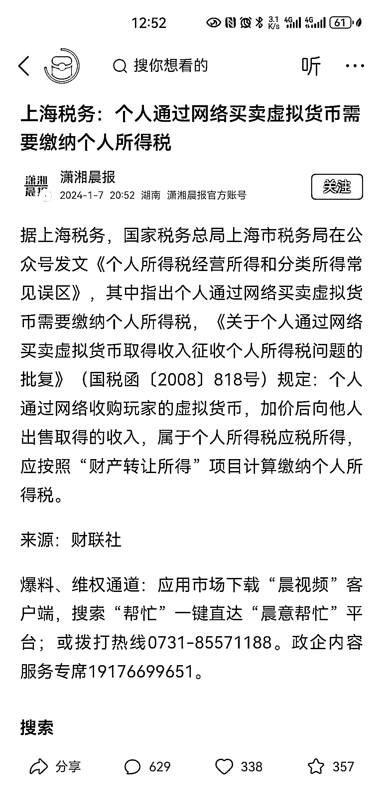

# 虚拟货币纳税新规，即将实施

> 原文：[`www.yuque.com/for_lazy/xkrm14/gqx0iuldxq9wgqtn`](https://www.yuque.com/for_lazy/xkrm14/gqx0iuldxq9wgqtn)

作者： Aimmon

日期：2024-01-08

点赞数：**24**

* * *

正文：

虚拟货币也要交税了

* * *

评论区：

朱朱侠 : 这是不是说明我国 ZF 下一步会放宽对虚拟币的监管？

Aimmon : 这不是更严了吗

柠檬🍋 : 貌似不是说的数据货币,可能指游戏币

Aimmon : 你再看看，北京商报指出，彼时，虚拟货币只有游戏币的概念，现在，包括比特币等等

小树 : 国内都禁止比特币了，还要收费？这就有点意思了

* * *

公众号搜索，懒人专属群分享