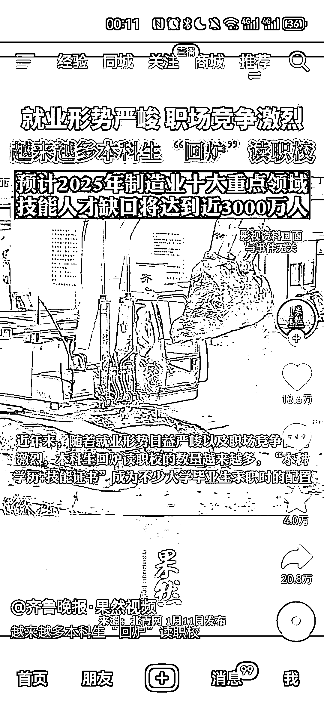
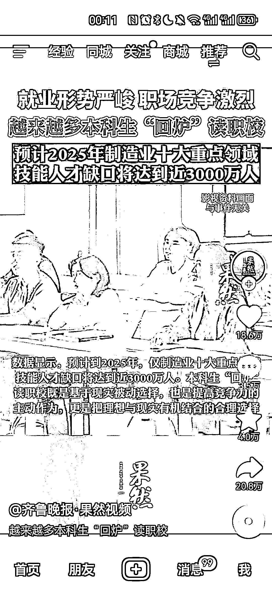

# 本科生回炉读职校，学历＋技能证书成就就业

> 原文：[`www.yuque.com/for_lazy/xkrm14/mtateqqsvo6an1p2`](https://www.yuque.com/for_lazy/xkrm14/mtateqqsvo6an1p2)

作者： 希平

日期：2024-01-12

点赞数：**70**

* * *

正文：

本科生回炉读职校，掌握技能 据统计，仅仅制造业的十大领域，技能人才缺口 3500w，不少本科生回炉读职校，“学历＋技能证书”成为了不少本科生求职的标配
也就是说，技能培训会逐渐被关注，比如直播运营，过去企业可能会从零培训，而现在倾向于招来就能干活。这使得大学生需要自己去学习，再去参加工作。
那么对于我们来说，将自己在职场的技能，去录制成课程或组建训练营，让大学生学了就能用上[呲牙][呲牙][呲牙]

* * *

评论区：

波叔 : 职校学生更吃香了

波叔 : 职业技能的实战课程大有可为

武雨菲 : 职业技能更实用

* * *

公众号搜索，懒人专属群分享