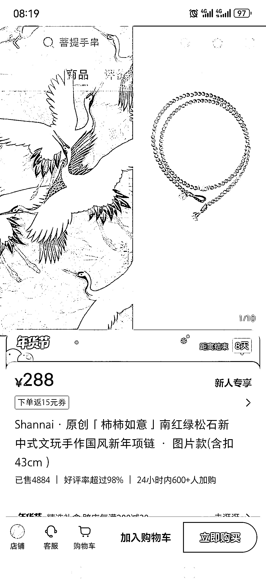
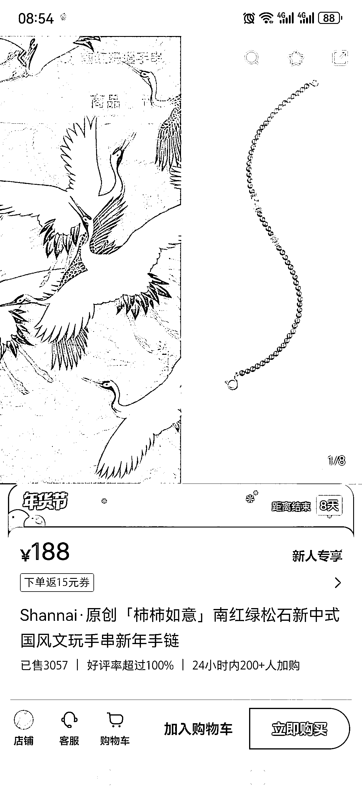
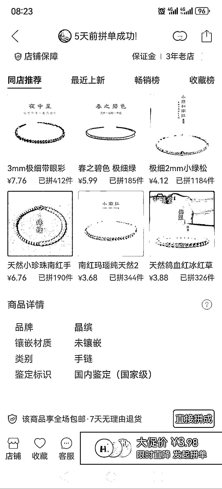
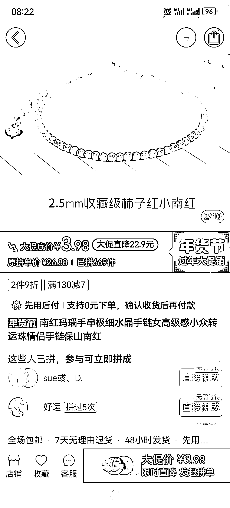
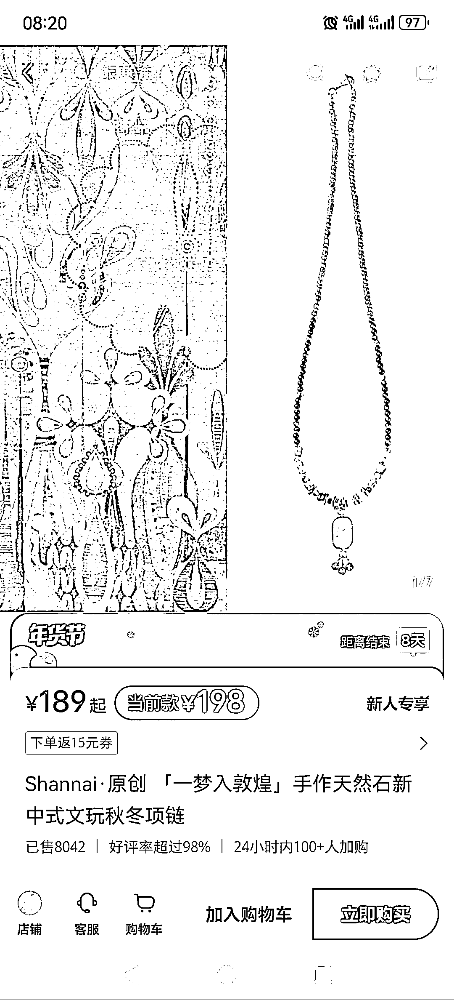
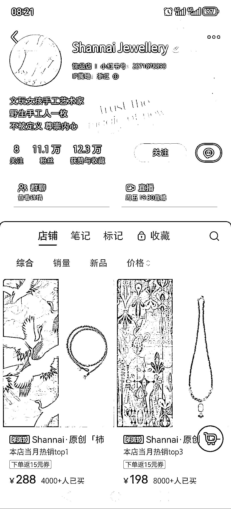
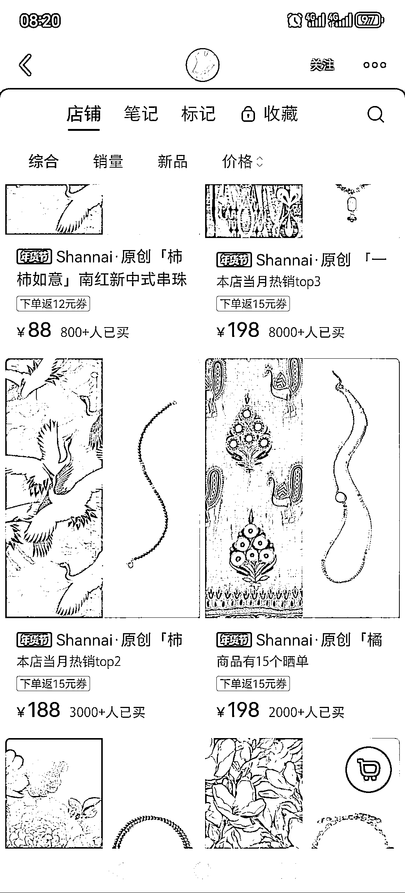

# 高销售量手作饰品-柿柿如意-小南红饰品，畅销新年国风饰品

> 原文：[`www.yuque.com/for_lazy/xkrm14/gwdggpm7sowxmib8`](https://www.yuque.com/for_lazy/xkrm14/gwdggpm7sowxmib8)

作者： 半阙酒

日期：2024-01-12

点赞数：**76**

* * *

正文：

高销售量手作饰品-柿柿如意/小南红饰品 小红书野生手作博主，主打原创手工，卖小南红绿松石新年国风饰品，包含项链，手链，戒指等
其中销量最高的的项链单价 288，售出 4884 件，销售量 140W+，手链单价 188，售出 3057 件，销售量 57W+
在多多搜了一家类似主打小南红绿松石的店铺，人家一件类似的手链才 15.8，差了一颗绿松石，这就是 188 和 15.8 的区别
至于 1688 批发这种珠子价格多少，已经不用多说了。
新年在即，大家都想要个好兆头，柿柿如意是个每年都火的主题，小南红手链高级好看，柿子红恰好契合这个主题，果然卖爆了。
这位博主的另一款超高销售量项链，一梦入敦煌，也是契合了近年来大火的敦煌风格，单价 189，售出了 8042 件，销售量 151W+。

* * *

评论区：

你好喵好你 : 这家店我之前好像还关注过，直播的风格也挺舒服

波叔 : 这个寓意好，利润高

奇思 : 同是饰品赛道价位真的差好多。。。

半阙酒 : 谢谢老大

半阙酒 : 所以卖这种饰品就去小红书啊

蒋小兔🍑 : 说的对啊

* * *

公众号搜索，懒人专属群分享