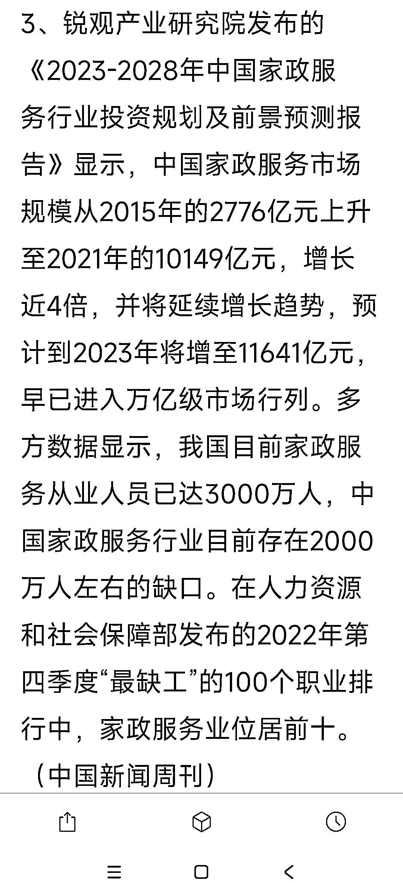

# 中国家政服务市场规模增长近 4 倍，预计将进入万亿级市场行列

> 原文：[`www.yuque.com/for_lazy/xkrm14/tkbzs030nzo21int`](https://www.yuque.com/for_lazy/xkrm14/tkbzs030nzo21int)

作者： 浮尘

日期：2024-01-12

点赞数：**38**

* * *

正文：

锐观产业研究院发布的《2023-2028 年中国家政服务行业投资规划及前景预测报告》显示，中国家政服务市场规模从 2015 年的 2776 亿元上升至 2021 年的 10149 亿元，增长近 4 倍，并将延续增长趋势，预计到 2023 年将增至 11641 亿元，早已进入万亿级市场行列。多方数据显示，我国目前家政服务从业人员已达 3000 万人，中国家政服务行业目前存在 2000 万人左右的缺口。在人力资源和社会保障部发布的 2022 年第四季度“最缺工”的 100 个职业排行中，家政服务业位居前十。（中国新闻周刊）

* * *

评论区：

波叔 : 大学生做家政的都越来越多了

* * *

公众号搜索，懒人专属群分享