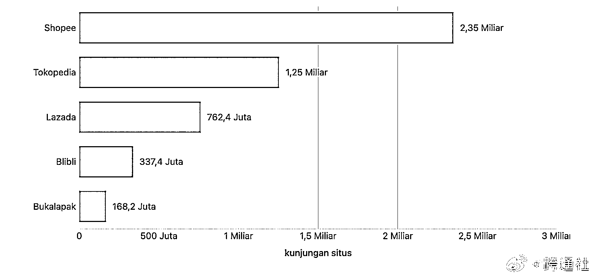
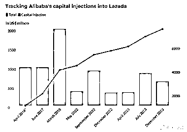
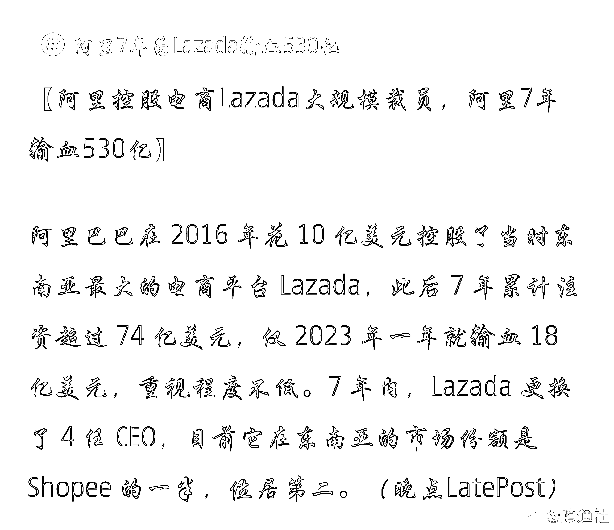
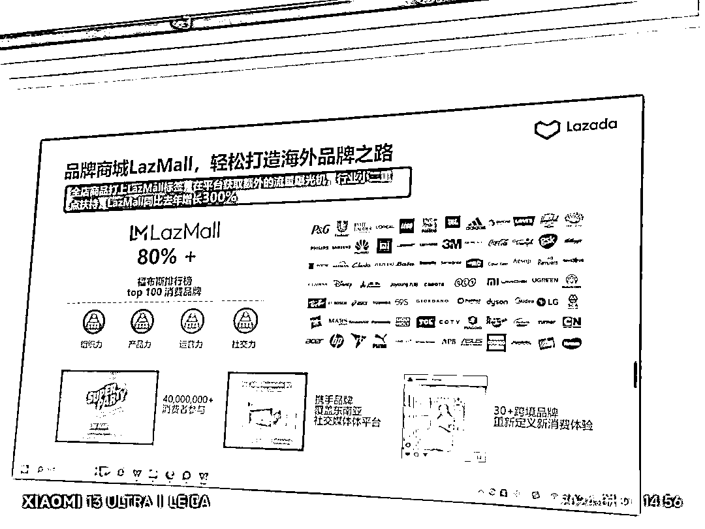
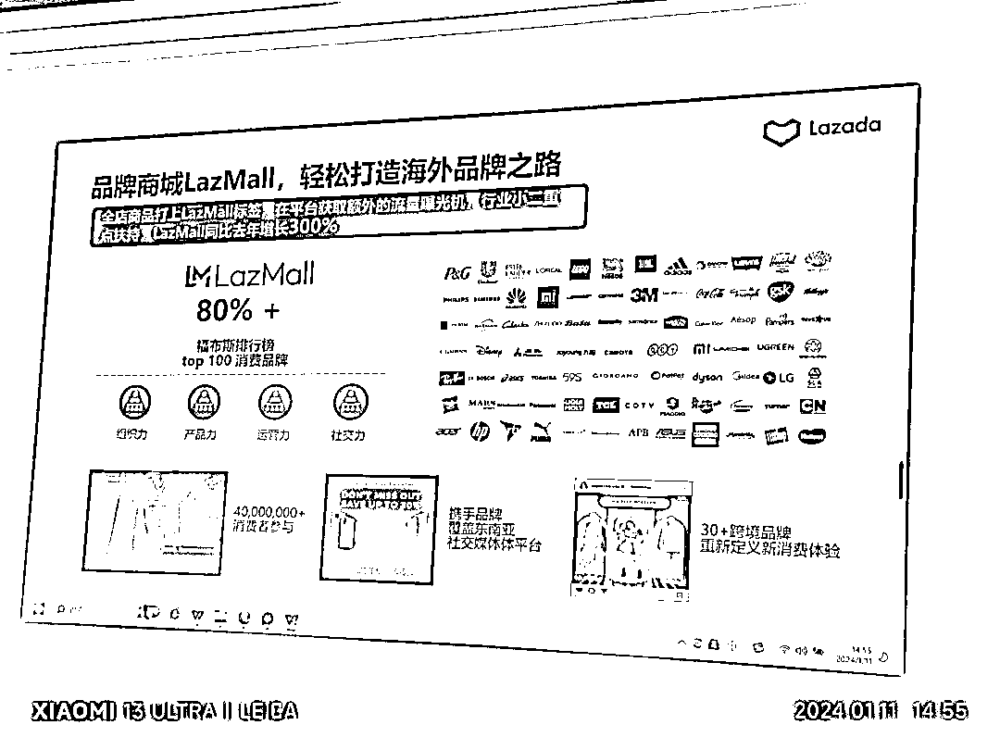
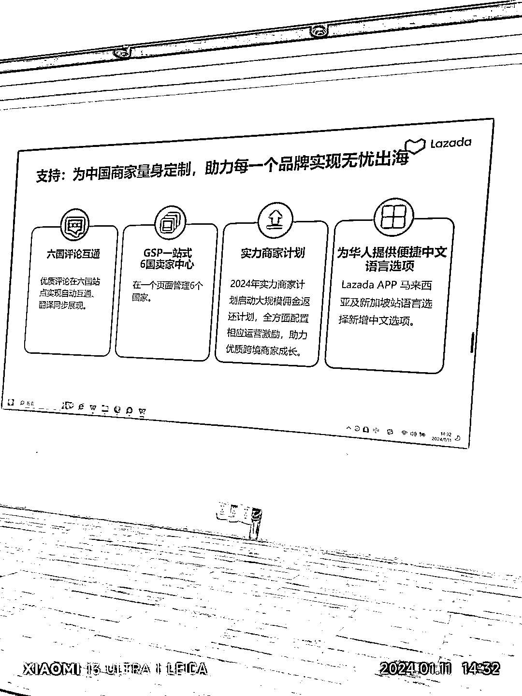
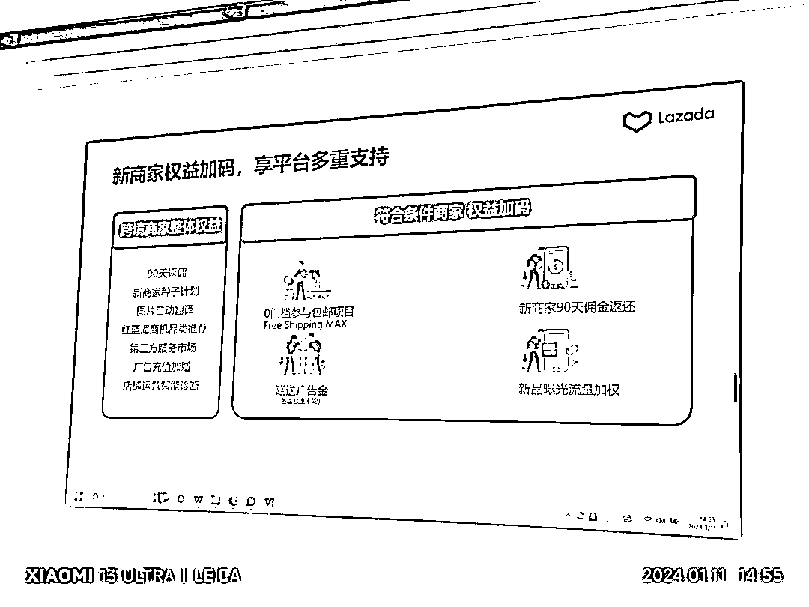
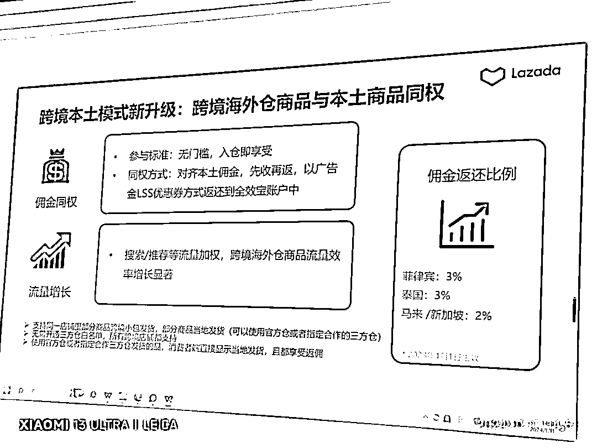

# 阿里为 Lazada 投入 530 亿，7 年努力，Shopee 成东南亚电商领导者

> 原文：[`www.yuque.com/for_lazy/xkrm14/bpglfa7od889pxih`](https://www.yuque.com/for_lazy/xkrm14/bpglfa7od889pxih)

作者： 李方元

日期：2024-01-11

点赞数：**35**

* * *

正文：

输血 530 亿，7 年光阴，阿里为 Lazada 操碎了心！！东南亚电商中
​​​Shopee 堪称印尼电商界顶流，2023 年访问量遥遥领先，后四位（包括 lazada）加起来才勉强能打一打。 ​​​（图源：databoks） ​​​
24 年开年，今天特意去听了线下的 lazada 自营跨境店的招商经理的讲解，lazada 设置了中心仓，自建仓和第三方合作仓，不需要白名单，所有跨境商家都可以加入，而且和本土店同权重！解决了跨境店商家想加入本土店，投资重，回款难得问题，根本就不用搞本土店了。还有和国内 ali 平台淘宝一样，有相当于天猫店的 Lazmall，搜索权重高，优先展示。ali 想卷 shopee 东南亚市场份额的心，明晃晃的啊。适合国内想在东南亚市场做自己品牌的商家。因为 ali 对中国商标的保护政策，还是挺不错的。——身为阿里系多年电商商家的亲身经历

* * *

评论区：

小刀 : 阿里要做也是做全球的电商，东南亚太小，都看不上。

灵动 : lazada 卖家后台用了真心想吐，从侧面可以看出阿里真的老了，530 亿投下去，后台居然还那么难用。 拼多多，shopee 后台真的简单好用很多。

李方元 : 😂😂😂有点一直扶不起来的感觉

李方元 : 😂😂😂

波叔 : 阿里老了，虾皮是腾讯系的吧

* * *

公众号搜索，懒人专属群分享