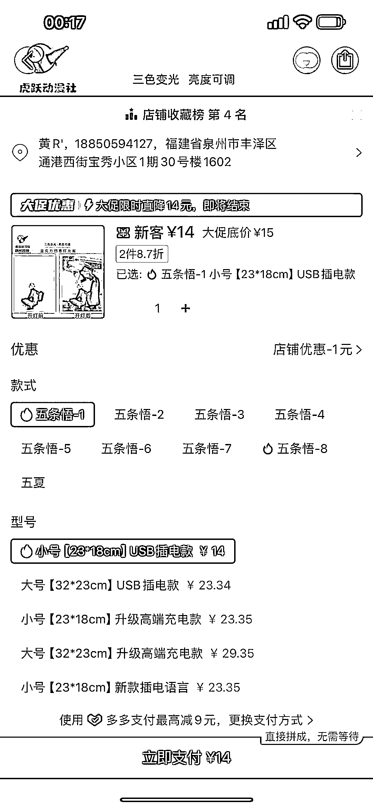
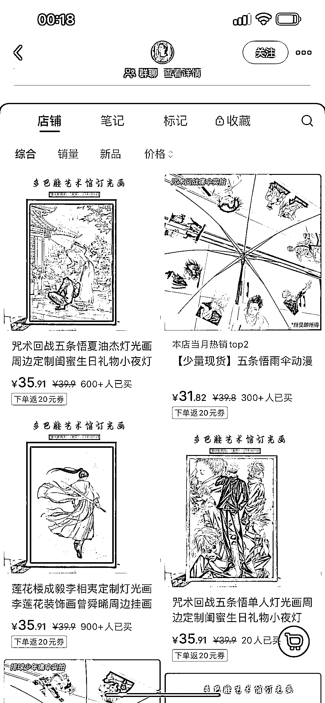
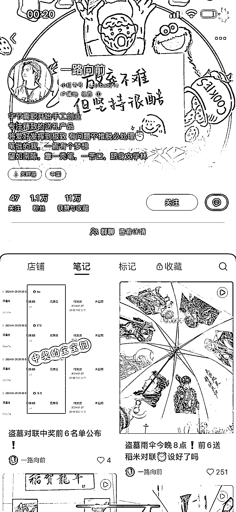
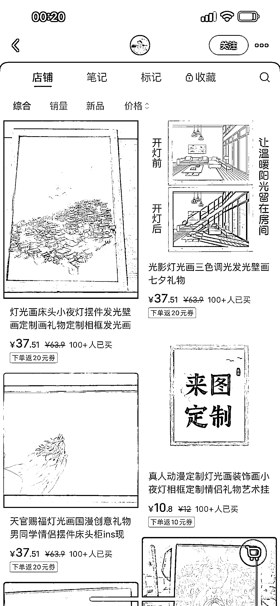
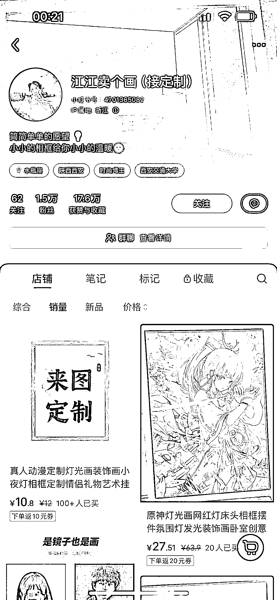
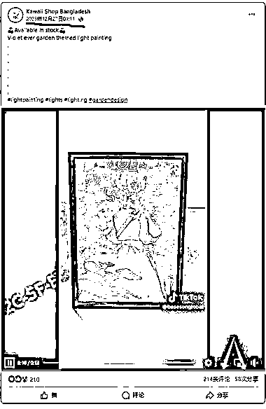
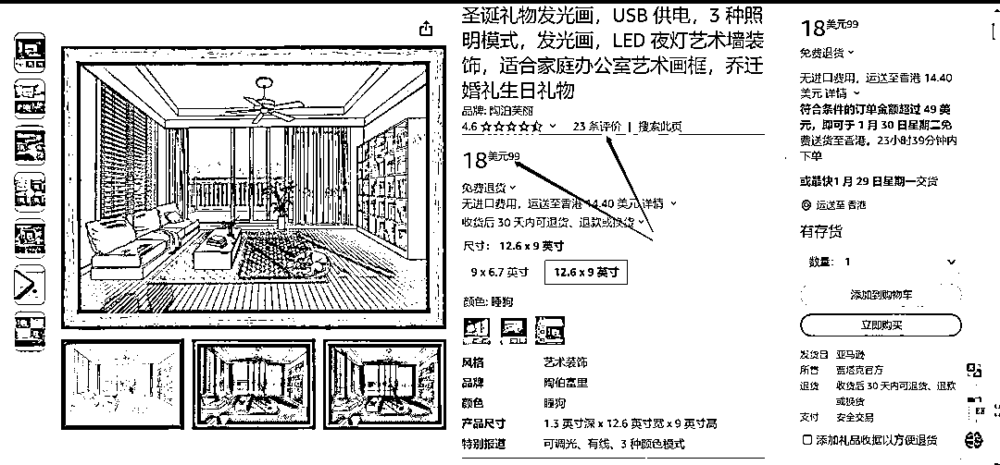

# 小红书灯光画：高利润空间，平台迁移多元化推广策略

> 原文：[`www.yuque.com/for_lazy/xkrm14/nl4w13dh15q71g1l`](https://www.yuque.com/for_lazy/xkrm14/nl4w13dh15q71g1l)

作者： Scott

日期：2024-01-22

点赞数：**34**

* * *

正文：

平台和项目：小红书-灯光画 盈利空间：拼多多成本 14￥， 小红书售价 35.9，毛利 20+￥
平台迁移：有做跨境的小伙伴也可以看下海外平台，目前看到亚马逊有人在销售，但目前销量没有特别火爆。Tiktok, Temu,等平台都可以了解看看，
也可以 Ins， 油管， 脸书等社媒看能不能吸引到一批粉丝,转 whatsapp 销售 附图：拼多多售价，小红书售价，亚马逊售价及销量，脸书 post
发布时间 23 年 12 月，目前点赞量 200+，视频有 tk 标签

* * *

评论区：

* * *

公众号搜索，懒人专属群分享