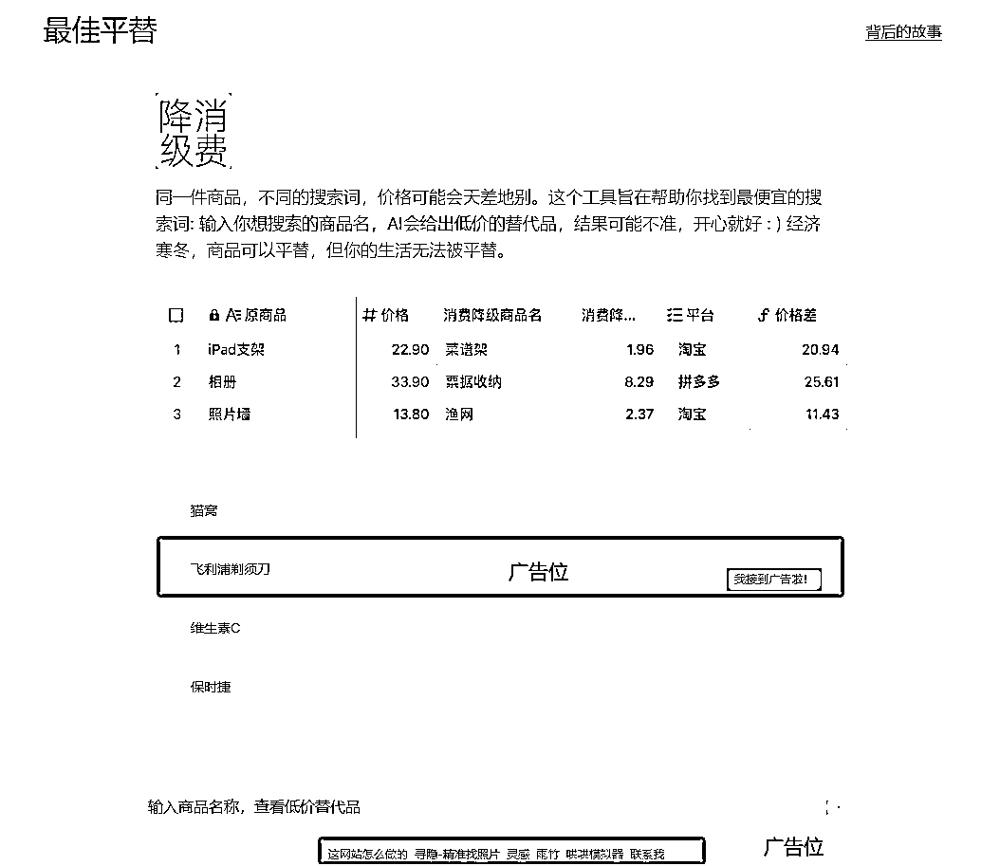

# AI+网站+平替生活用品：开创消费降级新趋势

> 原文：[`www.yuque.com/for_lazy/xkrm14/sfbq4y2ogbpqlpwm`](https://www.yuque.com/for_lazy/xkrm14/sfbq4y2ogbpqlpwm)

作者： 林幻雨

日期：2024-01-22

点赞数：**37**

* * *

正文：

赛道+垂类项目：AI+网站+平替生活用品 生活平替品，这本来就是一个长尾词，如果加上 AI 会产生什么样的化学反应呢？
今天在今日头条上看到一篇文章，里面介绍了一个网站，网址是：pingti.xyz 可以看到，界面目前很干净，也接到了广告。 目标人群：有消费降级需求的网购人群
需求：购买平替产品，便宜好用省钱 平台和项目：建立自有网站，所有平台推广引流 变现方式： 1.可以在使用中 插入广告切片
2.可以在平替的同时，插入链接，带货。带货可以分销，可以谈合作，最开始甚至可以简单的淘客分佣 AI 问答，可以在使用了以后。
可以进行引导，引导到自己的套壳 AI 站中， 方向非常多！

* * *

评论区：

* * *

公众号搜索，懒人专属群分享