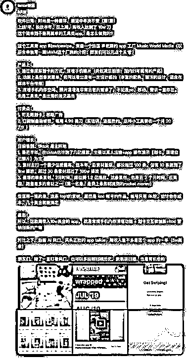
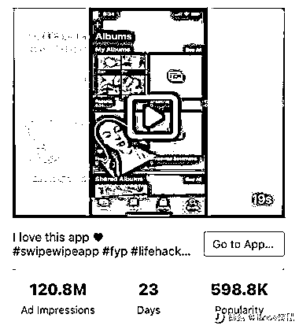
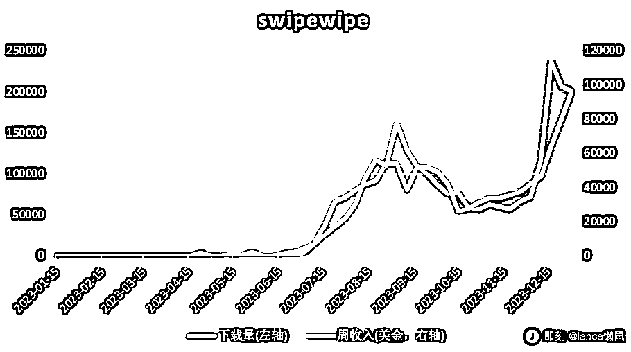
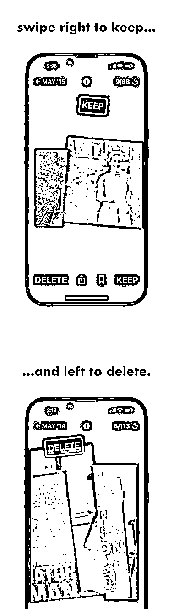

# 工具类 app“swipewipe”在 tiktok 上引爆爆款，周收入达 10w 刀

> 原文：[`www.yuque.com/for_lazy/xkrm14/pptsg6iehsd0cnr3`](https://www.yuque.com/for_lazy/xkrm14/pptsg6iehsd0cnr3)

作者： 蛤蟆先生

日期：2024-01-23

点赞数：**78**

* * *

正文：

平台和项目：工具类 app：swipewipe，清理手机内存空间、照片清理 引流方式：最近半年，在 tiktok 估计跑了几亿播放。主要以真人出镜+app
操作演示【划卡，清理自己照片】为主。素材主打一个量少但质量高。这半年，总素材量级，都没超过 100 条。但有 10 条跑到了 1kw 播放、超过 30
条素材超过了 100w 播放 3\. 最爆的单条素材，2 月时间，爆拉到 1.2 亿播放。这条素材，也是近 2 个月时间，在美国，跑量最多的素材之一
盈利空间：上线 1 年、投放半年，目前周收入达到了 10w 刀

* * *

评论区：

波叔 : 这个厉害，直接打爆

蛤蟆先生 : 是的很厉害，需求很简单，这个流量太猛了

小石头 : 有没有大佬解释下，直接在手机相册里不也能删除照片吗？为什么这么简单的需求还有用户花钱买单呢？

北辰 : 公众号后台也可以直接删文章，然后有个批量删文章的付费软件，还是按条数来收费。能够节约时间和精力，付点小钱很好。

北辰 : 又看了下这个 app，不仅仅是删除照片这么简单，而是采用【划卡】的方式。其实，这个把这个 app 理解为一个解压游戏，决策权在用户手上，左滑右划，很解压。另外，删照片本身是一种“消除”操作，“消除”操作其实满足人的“吃欲”，这个行为本身是可以带来愉悦感的。

蛤蟆先生 : 类似 tinder、探探这样的左滑删除，右滑保留功能

th : 其实市场上本来也有这样的产品，但是这个结合短视频真正打爆了

* * *

公众号搜索，懒人专属群分享