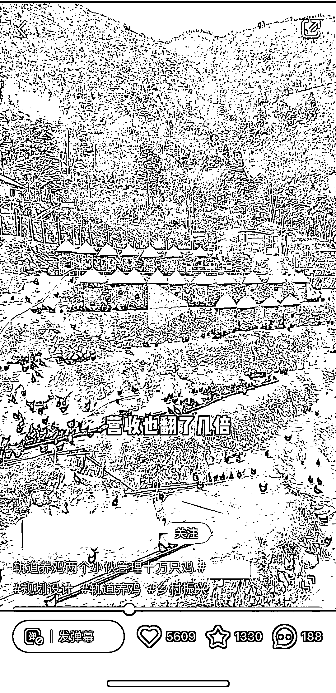

# 创意鸡窝：山地养鸡+旅游，一“鸡”多吃

> 原文：[`www.yuque.com/for_lazy/xkrm14/yvz8kup0a7h92yqc`](https://www.yuque.com/for_lazy/xkrm14/yvz8kup0a7h92yqc)

作者： 丁 Ding

日期：2024-01-23

点赞数：**74**

* * *

正文：

租一片山地养鸡好像没什么稀奇，但是这位老板把鸡窝规划成像梯田一样一层接一层，并且造型别致，就非常有想法了。
老板还专门造了一条轨道方便工作人员进行饲料的投喂和管理，可谓脑洞大开。
不止如此，老板还联合了搞旅游的公司，顺带推出了相关的旅游产品，既盘活了当地的旅游，还卖出了饲养的鸡，可谓一“鸡”多吃啊。

* * *

评论区：

波叔 : 原本第一产业，干成了第三产业，牛逼

丁 Ding : 哈哈哈，确实很厉害

丁 Ding : 谢谢亦仁大大～

穿着裤子的云 : 是一个有创造性的老板

丁 Ding : 哈哈，确实[呲牙]

* * *

公众号搜索，懒人专属群分享