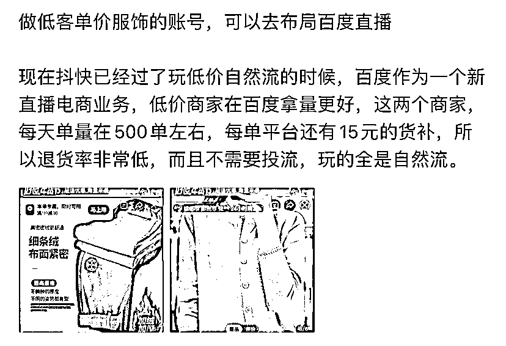

# 布局百度直播，低客单价服饰账号有机会获得更好的流量

> 原文：[`www.yuque.com/for_lazy/xkrm14/xzmvr91blgpdt1nw`](https://www.yuque.com/for_lazy/xkrm14/xzmvr91blgpdt1nw)

作者： 罗破帽

日期：2024-01-26

点赞数：**69**

* * *

正文：

a.做低客单价服饰的账号，可以去布局百度直播
b.现在抖快已经过了玩低价自然流的时候，百度作为一个新直播电商业务，低价商家在百度拿量更好，这两个商家，每天单量在 500 单左右，每单平台还有 15 元的货补，所以退货率非常低，而且不需要投流，玩的全是自然流。

* * *

评论区：

* * *

公众号搜索，懒人专属群分享