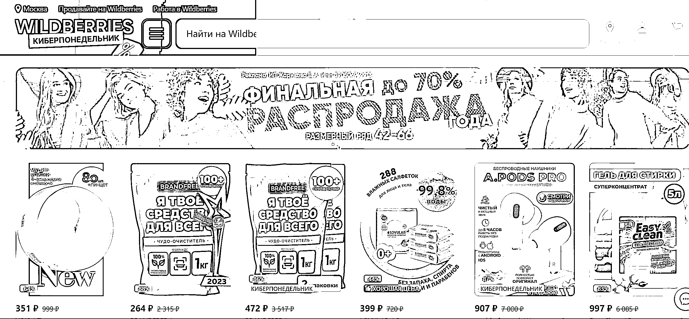

# 俄罗斯电 针对入驻商家，WB 也将提供佣金特惠，以及超 300 万平方的海外仓物流支持

> 原文：[`www.yuque.com/for_lazy/xkrm14/ci8gfpef4zgqsero`](https://www.yuque.com/for_lazy/xkrm14/ci8gfpef4zgqsero)

作者： 李瑞腾

日期：2024-01-23

点赞数：**43**

* * *

正文：

俄罗斯电商 WildBerries 2023 年 GMV 达 258 亿美元 2023 年 WB 全年 GMV
共达到 258 亿美元，日均 1000 万单，共有 100 万商家在平台活跃。 WB
中国区跨境业务仍处在测试阶段，首批白名单已开放 200 位商家入驻，短短三周，已有卖家实现了 50 万的销售业绩。
针对入驻商家，WB 也将提供佣金特惠，以及超 300 万平方的海外仓物流支持。

* * *

评论区：

离心之巅 : 这个帖子也是关于 WildBerries 的，不知道是不是同一个平台😂[`t.zsxq.com/16aIwhuQZ`](https://t.zsxq.com/16aIwhuQZ) 

李瑞腾 : 这个圈友是被那个人骗了，（估计用了假网站）与平台无关，问了俄罗斯人，WB 用的人很多

* * *

公众号搜索，懒人专属群分享