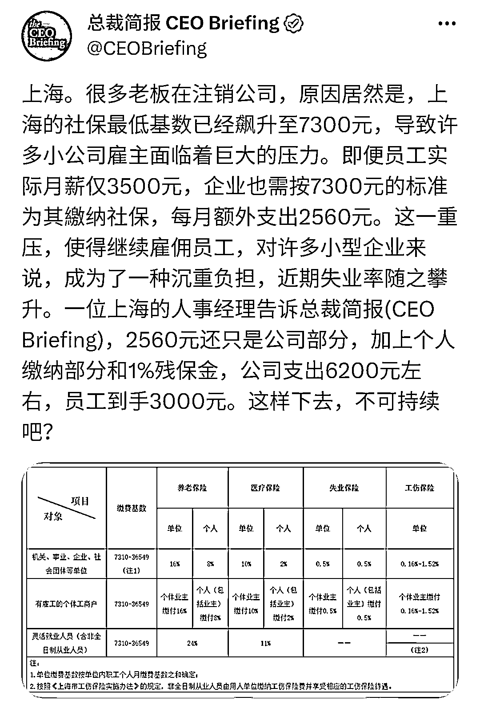

# 上海公司注销潮，经营困难导致部分企业选择退出市场

> 原文：[`www.yuque.com/for_lazy/xkrm14/ctk79ql85ztd3ong`](https://www.yuque.com/for_lazy/xkrm14/ctk79ql85ztd3ong)

作者： 歧黄之后

日期：2024-01-22

点赞数：**43**

* * *

正文：

上海出现注销公司潮 疫情后，金融危机前，公司经营越来越难 部分上海公司选择注销，部分选择异地缴纳社保 是一个高需求的事情，有记账和注册公司服务的可以关注一下

* * *

评论区：

苦 : 我想问一下，这个是那个软件看到呀

歧黄之后 : 脸书

* * *

公众号搜索，懒人专属群分享