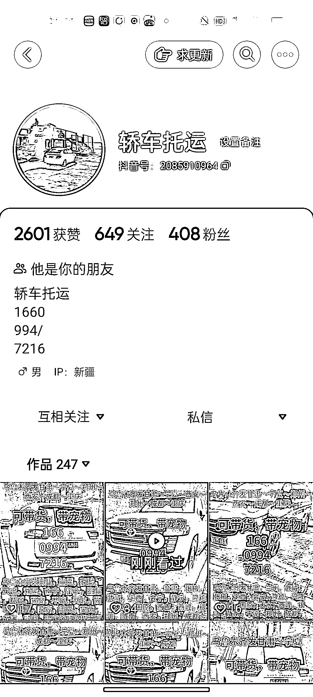

# 利用抖音、快手平台解决偏远地区急送问题，创造丰厚盈利空间

> 原文：[`www.yuque.com/for_lazy/xkrm14/cpsgfidhsrdm7k6n`](https://www.yuque.com/for_lazy/xkrm14/cpsgfidhsrdm7k6n)

作者： 离陌

日期：2024-01-22

点赞数：**28**

* * *

正文：

目标人群：偏远地区需要送急件，或者远程拼客的车主，比如新疆，贵州
需求：线上急送业务，业务员水客户，反复取消订单，线上下单，取消后走私单。线下车主和客户约定后，客户出于不信任，水车主。
平台和项目：在抖音，快手平台，发布拼车信息，寄送，小件托运信息，引流车主，可以引流至交流群，收入群费，或者开发小程序，收保证金，双向收佣金，核心是弥补部分偏远地区物流急件无法到达的情况，以及解决车主和乘客之间不信任问题。重点推荐区域，新疆。
盈利空间：根据情况粗略预估，一天成交 5 单，每单利润 100，月利润轻松 15000，加大推广，起量后更多。

* * *

评论区：

* * *

公众号搜索，懒人专属群分享