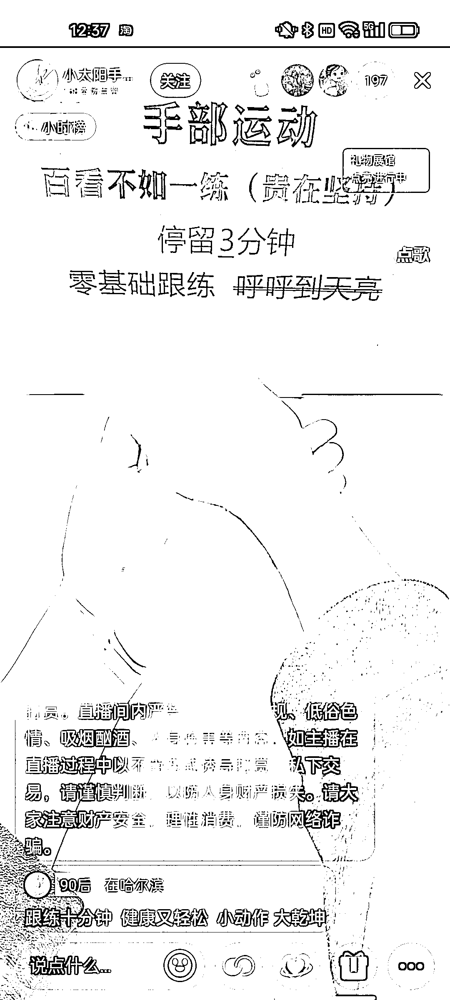
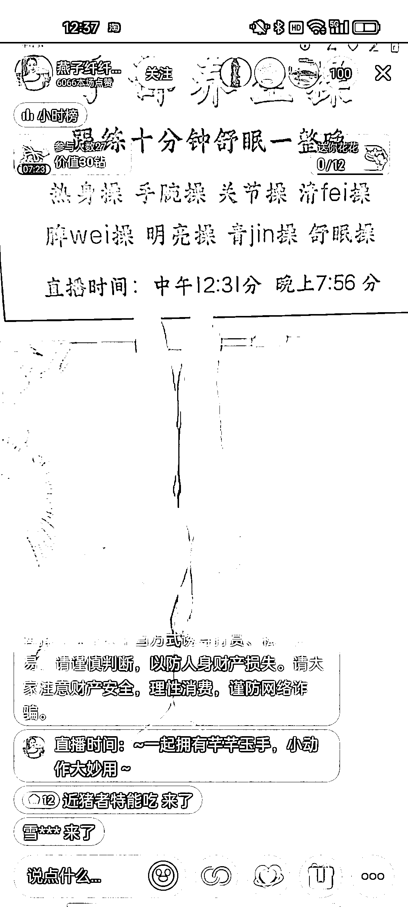
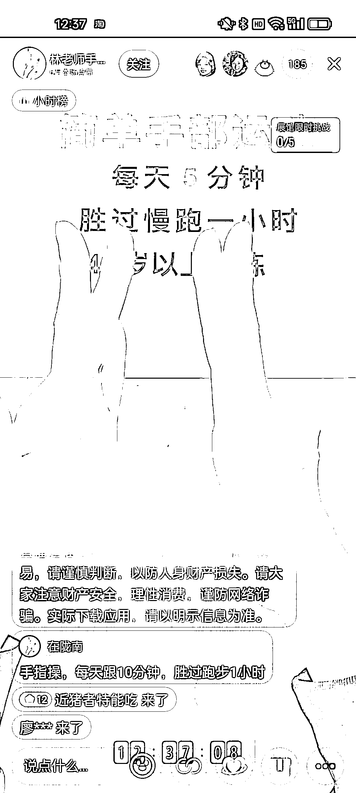
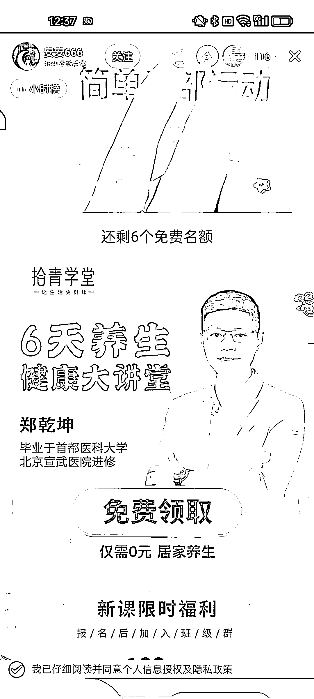
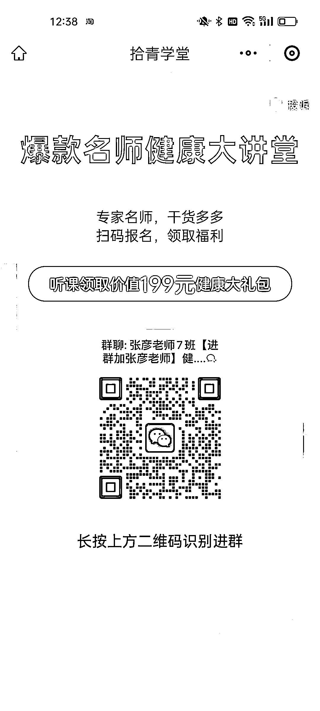
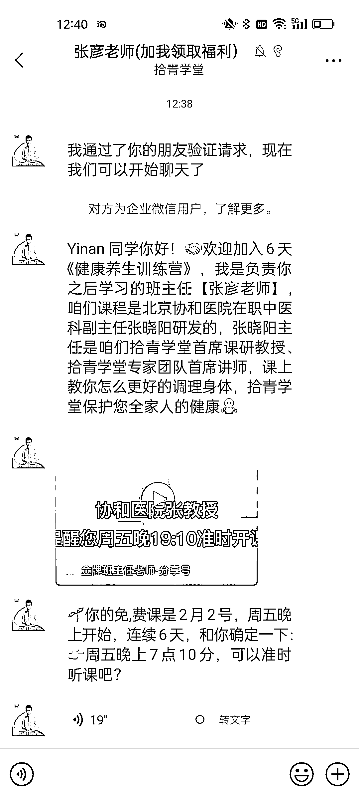
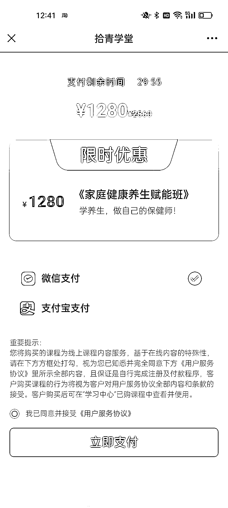

# 抖音直播引流私域变现，中医养生赛道中老年市场潜力巨大

> 原文：[`www.yuque.com/for_lazy/xkrm14/xk48t8lsqn0madmt`](https://www.yuque.com/for_lazy/xkrm14/xk48t8lsqn0madmt)

作者： 哇咔丸

日期：2024-01-31

点赞数：**51**

* * *

正文：

最近抖音上做【手指操】直播矩阵的知识付费变现链路刚刚开始，有点模仿国学课和情感课的直播引流到私域变现的模式。 1.
直播间平均场观 100-300 人次，每日按播 10 小时来算，一天引流到私域大概在 1000 人次，能形成 4-5 个微信社群。按免费流量单线索成本计算，一天单账号直播引流产生的经济效益大概有 30*1000=3w
元。非常可观! 2\. 变现模式: 0 元体验课转 1280 元初阶课，体验课为 5 天家庭中医养生私域直播，直播为假直播。 3\. 投产比:
预估首单投产比为 1.5。但是中老年人群粘性高，复购强，1280 元首单付费用户购买中介课的转化率一般为 20-30%。所以首单成交为重中之重。
中医养生的中老年赛道越加红火，今年布局的机构非常多。

* * *

评论区：

晓添 : 最近刷到好几次，原来变现路径是这样的[色]

哇咔丸 : 哈哈你是做什么项目的

弃天 : 这种能操作直播分销不？

晓添 : 目前主做虚拟和票务[呲牙]

哇咔丸 : 能，你做这个业务吗？

弃天 : 有后端交付团队不？

哇咔丸 : 有的

* * *

公众号懒人搜索，懒人专属群分享