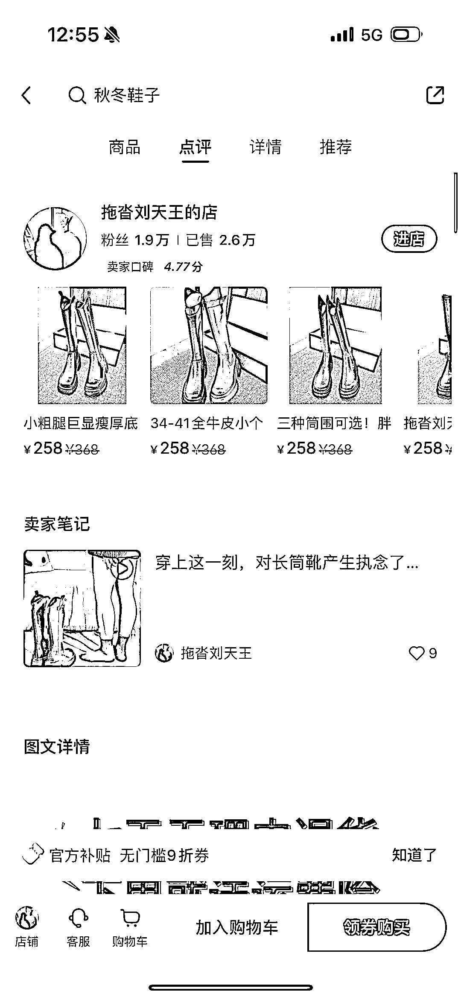
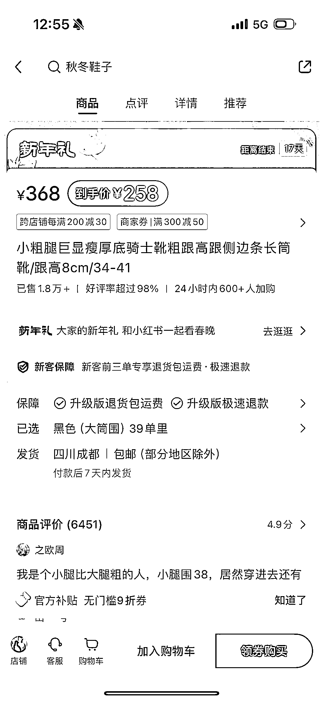
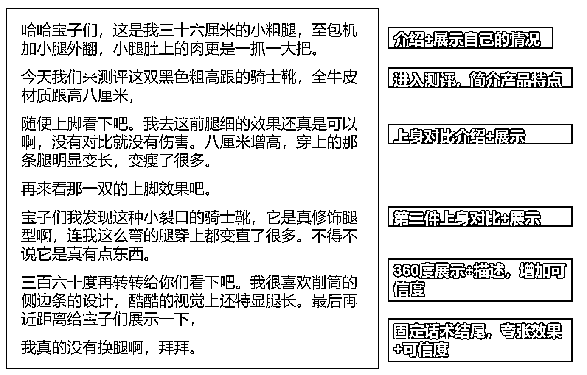
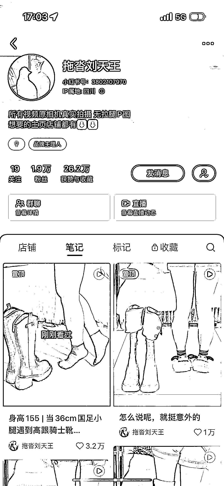

# 小红书博主靠粗小腿赚 600w+销售额，普通人身材成财富密码

> 原文：[`www.yuque.com/for_lazy/xkrm14/fh7k20bgfh9cs9ue`](https://www.yuque.com/for_lazy/xkrm14/fh7k20bgfh9cs9ue)

作者： 李子木

日期：2024-01-30

点赞数：**88**

* * *

正文：

靠一双粗小腿，1.9w 粉小红书销售额 600w+ . 在小红书刷到这个博主，我突然意识到，普通人的不完美身材，是小红书上新的财富密码。 .
小腿跟大腿一样粗的我，想买双长筒靴回家过年，结果在小红书刷到这个了博主，1.9w 粉，店铺成交量确有 2.6w，她的鞋子，客单价并不低，都在 250 元左右，算下来，销售额超过 650w。
. 这双将近 300 元的靴子，半小时加购人数就有 600+。 . 而且她的视频做起来特别简单： 【视频内容】试穿鞋子，拍视频，展示效果，
【文案结构】也很简单，下图是她的爆款视频文案和拆解。 【发布频率】昨天一天，她就发了 12 条视频，一双鞋可以拍一条视频，也可以几双鞋做一条，剪辑成多条视频。
. 【延展思考】 1、放大缺点做小红书
还想要做小红书的普通人，可以尝试去放大自己的缺点。比如背比较厚，穿哪些衣服会更好，比如喜欢偷懒，可以去分享怎么给自己启动的动力、怎么一边偷着懒一边高效完成事情，比如内向，可以去分享自己摸索出的跟别人相处的方法，比如记性差，可以去分享给自己提示的小妙招……
. 不完美的人才是大多数，一定有很多人，面临着跟我们同样的问题，把你遇到的问题记下来，然后找到解决的办法，说不定可以吸引到跟你有同样困扰的人。 .
2、在小红书变现，买手带货>接广
如果你还没有找到合适的小红书运营方向，可以试试买手类、好物推荐类，不仅品牌方更喜欢，自己的变现能力也更强，做直播买手带货，也更能无缝对接。 .
可以搜刮一下自己身边，家里、办公室，觉得好用的东西有哪些，有哪些东西，是会给身边的朋友推荐的，如果记不起来，就去翻自己的订单，总会翻到一些想要分享的东西。
项目拆解

* * *

评论区：

Hearty : 好棒！请问 p3 是用什么 app 做的？总结的很有条理

* * *

公众号懒人搜索，懒人专属群分享