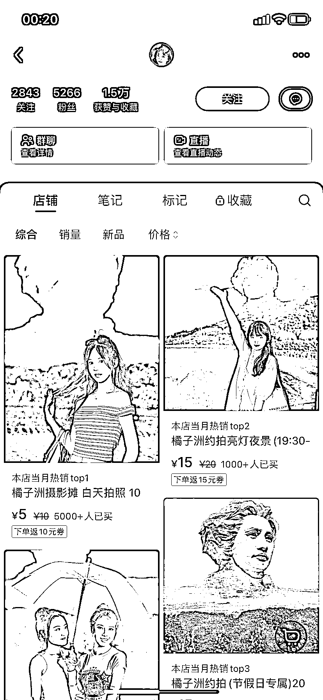

# 小红书开店，接热门景点跟拍-约拍

> 原文：[`www.yuque.com/for_lazy/xkrm14/xf8h3wyb8w9g5zfu`](https://www.yuque.com/for_lazy/xkrm14/xf8h3wyb8w9g5zfu)

作者： 罗破帽

日期：2024-01-30

点赞数：**39**

* * *

正文：

【小红书开店，接热门景点跟拍/约拍】
a.在小红书开店铺接某个热门景点跟拍/约拍。像这个店铺，白天拍照 10 元/张，夜景 20 元/张，单人是要三张起，以此类推，已售总计 7674，利润近 9.4 万。
b.这还是只算单人三张的情况下，像旅游一般都是组队。利润比目前算的还会高很多。
c.在自己所在的城市有热门景点，可以在小红书开店接单。小红书又是以女性为主，天生喜欢拍照，在小红书接单有天然优势。除了跟拍/约拍，还可延伸到本地生活服务。

* * *

评论区：

* * *

公众号懒人搜索，懒人专属群分享