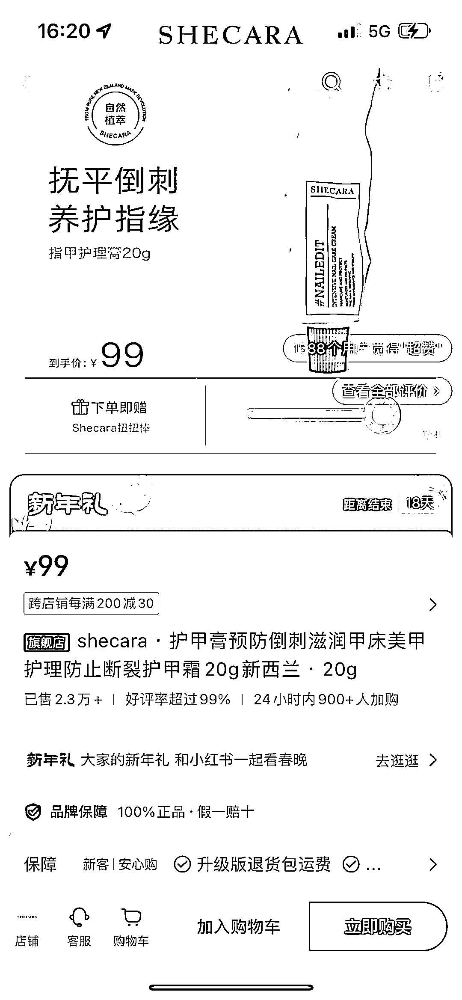
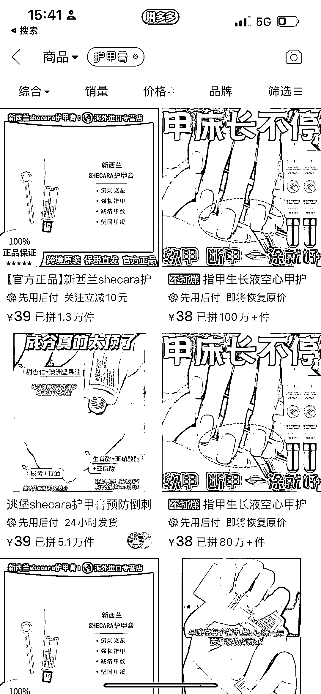
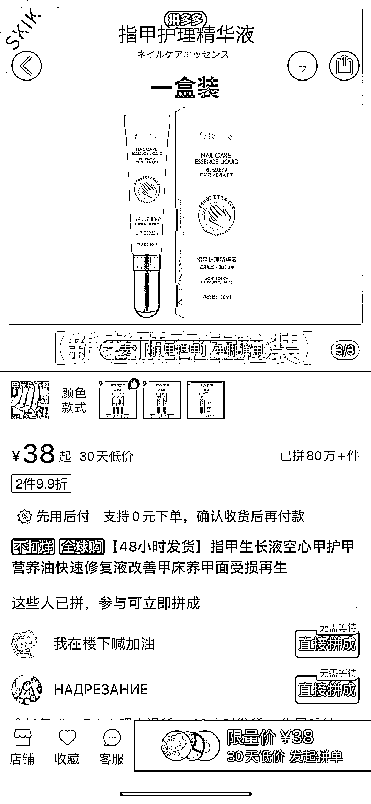
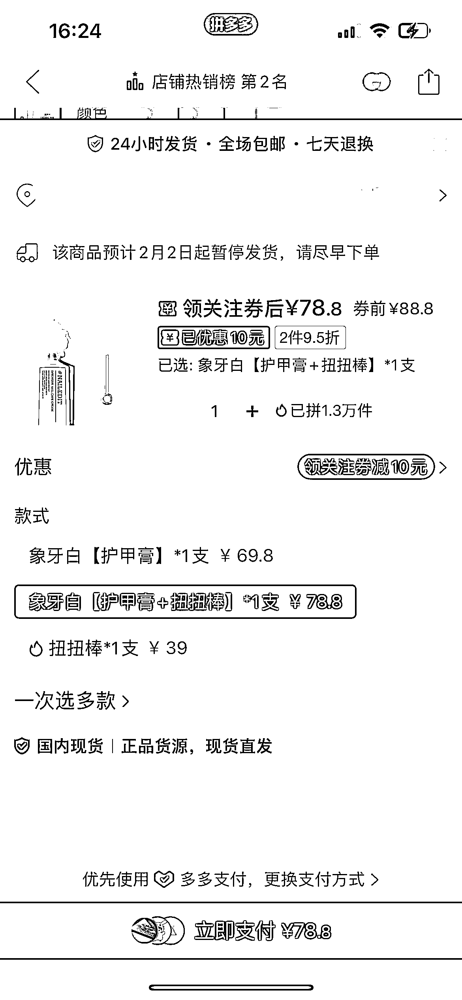
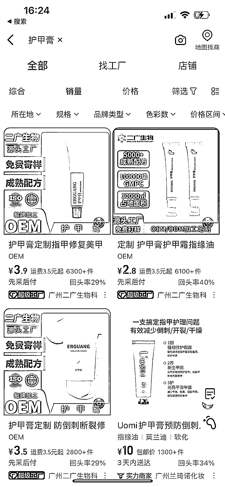

# 护甲膏：小红书销量高达 2.3 万+，利润空间大

> 原文：[`www.yuque.com/for_lazy/xkrm14/gkblysid2ii6fwpq`](https://www.yuque.com/for_lazy/xkrm14/gkblysid2ii6fwpq)

作者： 真实姓名

日期：2024-01-29

点赞数：**37**

* * *

正文：

护甲膏 小红书单价 99，销量 2.3 万+ 拼多多同款 78.8，销量 1.3 万+ 拼多多竞品单价 38，销量 100 万+
阿里巴巴可以 oem 贴牌，单价 3.9，2000 起批 利润空间大，gmv 破千万。

* * *

评论区：

小七 : 这个对经常做美甲的好

加麻 : 感觉护肤品比较吃品牌

* * *

公众号懒人搜索，懒人专属群分享