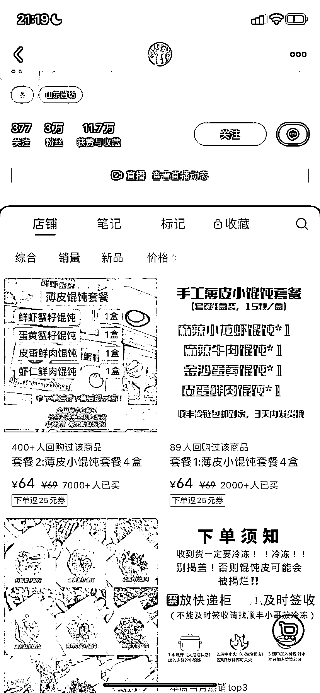

# 小红书博主销售混沌，累计销售额 77.4 万

> 原文：[`www.yuque.com/for_lazy/xkrm14/pehpgex5gsl98vzt`](https://www.yuque.com/for_lazy/xkrm14/pehpgex5gsl98vzt)

作者： 罗破帽

日期：2024-01-29

点赞数：**23**

* * *

正文：

a.3 万粉丝博主，小红书上卖混沌，4 盒装：单价 69 元，已经卖出 9360 单，5 盒装：单价 99 元，已经卖出 1291 单，累计销售额 77.4 万。
b.手工包的混沌，加上购买后没有退货，混沌皮加原料也可批发购买，所以利润相对比较高。

* * *

评论区：

星星 : 视频号这个品能行不？

罗破帽 : 测试一下😬

星星 : 差了一下 没有品

* * *

公众号懒人搜索，懒人专属群分享