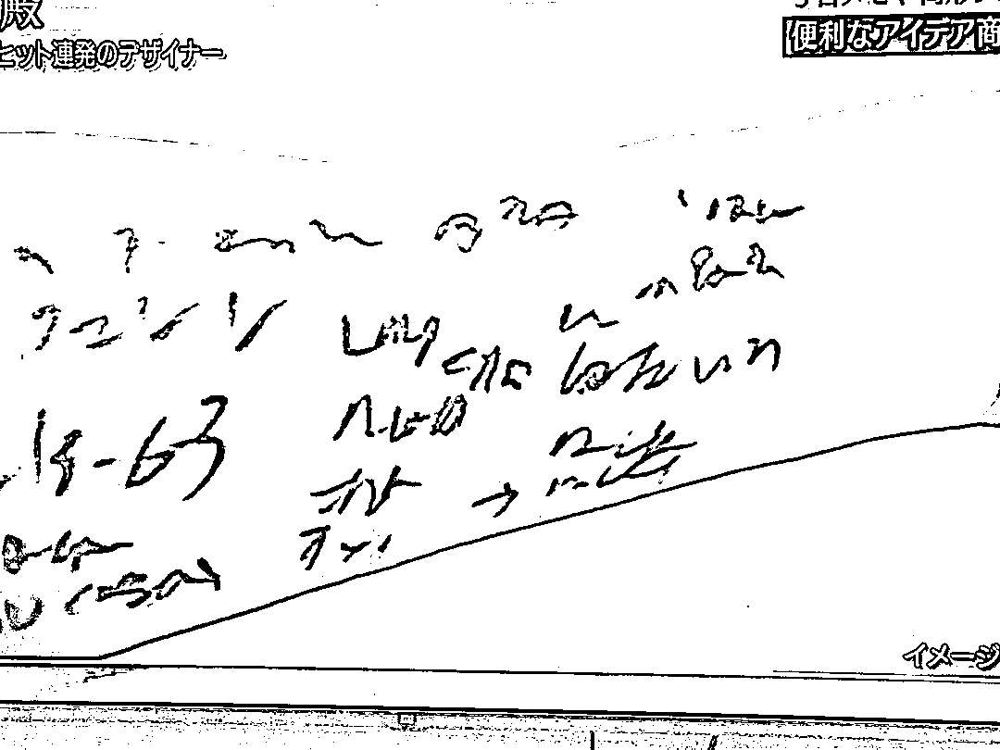
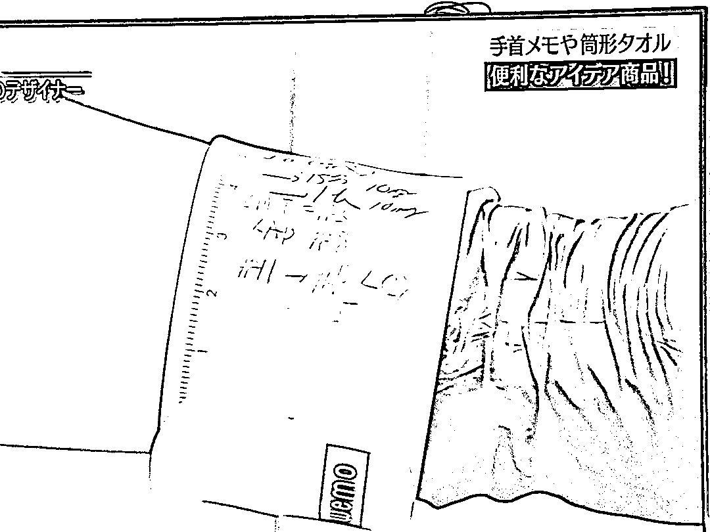
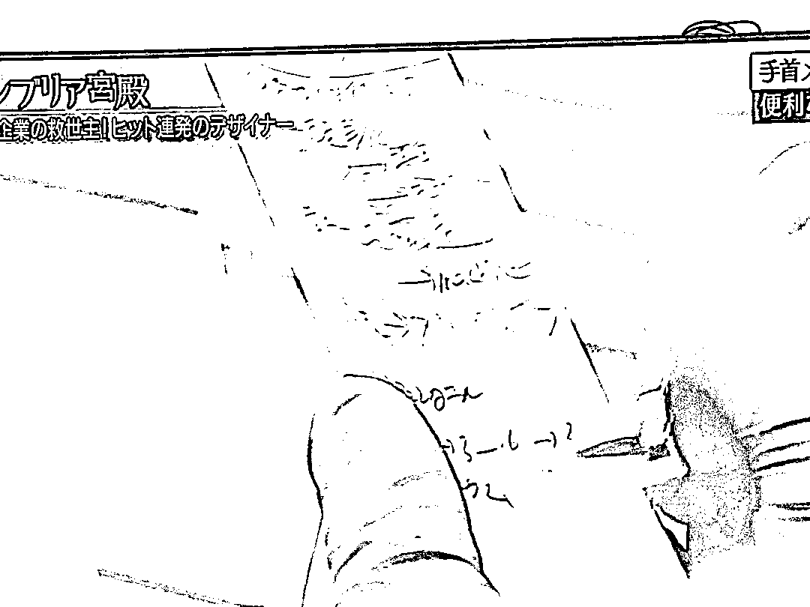

# 方便涂写的手环“wemo”成热卖，满足医护人员和建筑工地的需求

> 原文：[`www.yuque.com/for_lazy/xkrm14/kf72mpo3d2i9bufb`](https://www.yuque.com/for_lazy/xkrm14/kf72mpo3d2i9bufb)

作者： 卧牛山王叔

日期：2024-02-02

点赞数：**126**

* * *

正文：

有痛点，就有商机。 因为医护人员、建筑工地，工作人员经常会在自己手上记录数据，并不是都方便带纸记录的。
于是有人开发出了方便涂写的手环(名字叫 wemo)，据说一进入市场，立刻大卖。

* * *

评论区：

蝴蝶 : 哈哈哈哈

* * *

公众号懒人搜索，懒人专属群分享