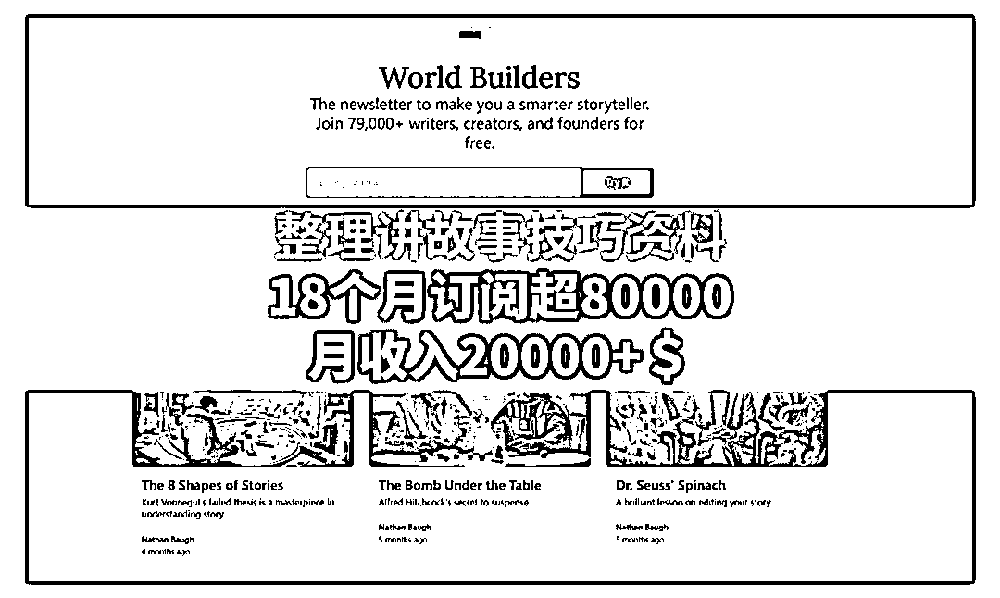

# 讲故事技巧资料整理，订阅超 80000，月收入 20000+美元

> 原文：[`www.yuque.com/for_lazy/xkrm14/hhtyhhnt94rgefd3`](https://www.yuque.com/for_lazy/xkrm14/hhtyhhnt94rgefd3)

作者： 罗破帽

日期：2024-02-01

点赞数：**94**

* * *

正文：

a.整理讲故事技巧资料，18 个月订阅超 80000，月收入 20000+美元
b.每一期通讯都会探讨一个公司或领导者/创始人如何突破喧嚣吵杂的声音，清晰讲述他们产品的故事。目前 8 万的订阅用户，是没有付费机制的，他的盈利主要靠：
1.如果你想用实用的方法在每天不到 25 分钟的时间内提高故事写作水平，请查看 StoryWork（350 多名学生）
2.要想走在人工智能的前列，请查看《90 分钟小说大纲》。这是一个 90 分钟的迷你课程，深入探讨用人工智能写小说。提示、流程等。我们有 180
多名学生参加了现场课程，效果非常棒。 3.如果你有兴趣开始或将你的时事通讯提升到一个新的水平，请查看我的时事通讯速成班（60 多名学员）

* * *

评论区：

石乔文 : 补个网址：[Just a moment...](https://www.worldbuilders.ai/)

* * *

公众号懒人搜索，懒人专属群分享