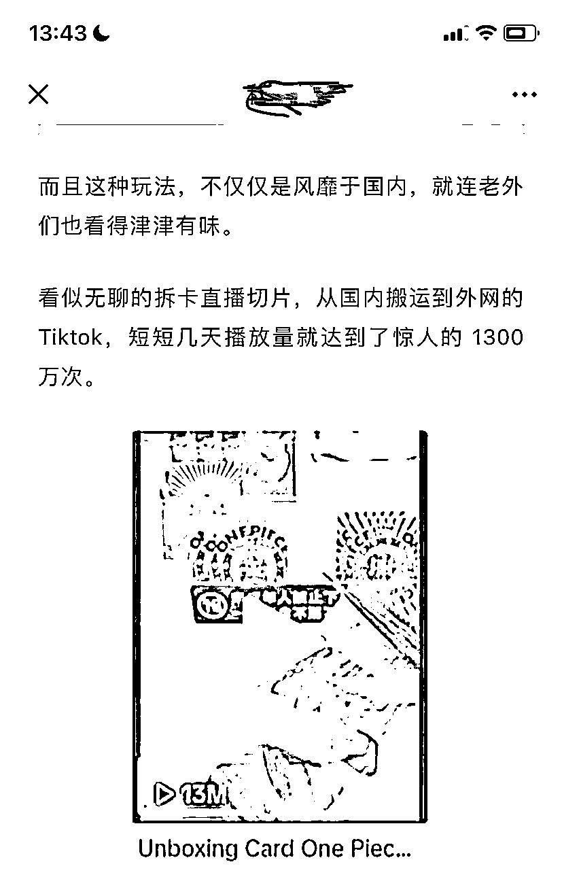
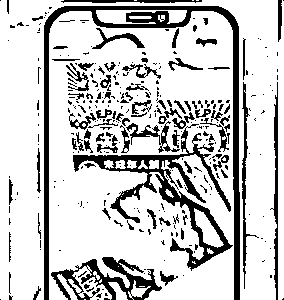
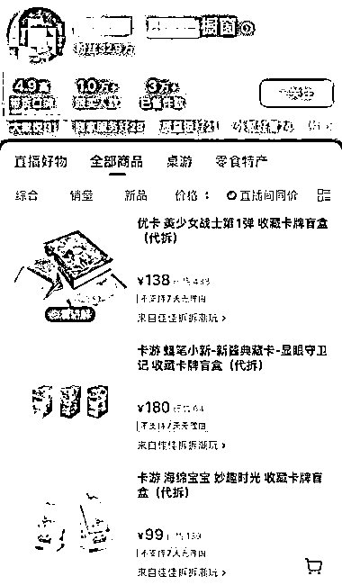

# 直播盲盒拆卡：运气成就百万收入，播放量破千万

> 原文：[`www.yuque.com/for_lazy/xkrm14/sxrc3ocoyvcdqksy`](https://www.yuque.com/for_lazy/xkrm14/sxrc3ocoyvcdqksy)

作者： 罗破帽

日期：2024-01-31

点赞数：**50**

* * *

正文：

【直播盲盒拆卡】 a.先在直播间下单排队。一般就是按盒来买，一盒 10
张，售价几十元到一两百不等。每包能拆出什么卡来不知道，全凭运气。顾客下单之后，他们自己不拆，而是交给主播现场拆。
b.有人一次就下单好几盒，而这些拆卡主播的店铺销量基本也都过万，退货率则为零。这意味着光靠卖卡他们也有几百万的收入，甚至多的有上千万。
c.然后将拆卡直播切片，从国内搬运到外网的 Tiktok，短短几天播放量就达到了惊人的 1300 万次。

* * *

评论区：

W.韦同学 : 牛[啤酒]

爱拼才会赢 : 会强制退款吗

x : 正版卡成本也很高的，价格也透明，利润没那么多

* * *

公众号懒人搜索，懒人专属群分享