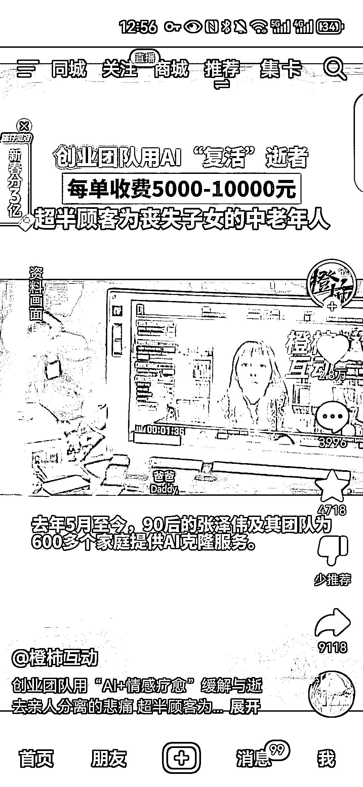
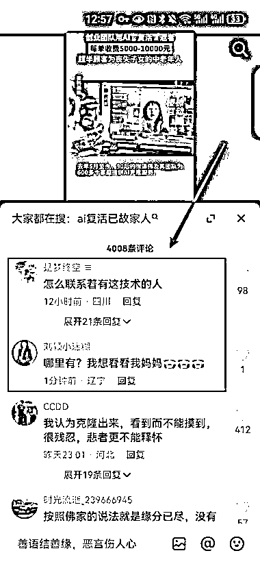

# AI 克隆技术助力中老年人“复活”逝者，销售火爆

> 原文：[`www.yuque.com/for_lazy/xkrm14/er1s5s2wki2nc5zl`](https://www.yuque.com/for_lazy/xkrm14/er1s5s2wki2nc5zl)

作者： 希平

日期：2024-01-30

点赞数：**68**

* * *

正文：

国内有个创业团队，用 AI“复活”逝者 需求：新闻发出去，4000 多评论，我数了 100 条，就有 30 条问怎么做/哪里有。 对象：丧失子女的中老年人
产品：AI 克隆技术，也就是 AIGC 数字人。 销售数据：从 2023 年 5 月至今，短短 7 个月，该团队已为 600
多个家庭提供了服务，起码卖了 600 单，每单收费 5000-1w 元，销售额 300w-600w

* * *

评论区：

牧言木语 : 这个怎么做呀？有课程吗？

希平 : 知识星球搜索“AIGC 数字人”，本质就是不断用逝者的视频图片、音频等去生成一个虚拟人

小七 : 天呐，电影里的故事成真了

三牛同学 : 是不是换脸？

希平 : 不是换脸，而是用逝者的照片跟声音，合成一个虚拟人

Beautiful * : 找到相关教程了么？

竹子。 : 我会做但我有点害怕[捂脸]

* * *

公众号懒人搜索，懒人专属群分享