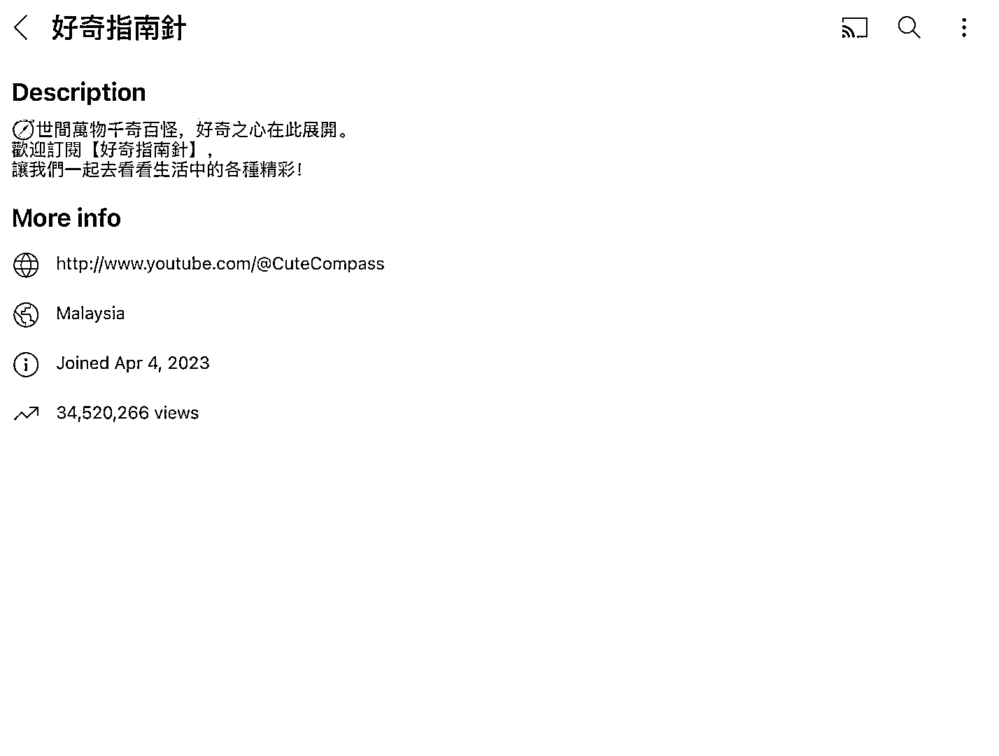

# 全球猎奇事物 YouTube 账号，涨粉 11W+，播放量超 3400W

> 原文：[`www.yuque.com/for_lazy/xkrm14/vqgiarygye0rgzfg`](https://www.yuque.com/for_lazy/xkrm14/vqgiarygye0rgzfg)

作者： 仰仰

日期：2024-01-29

点赞数：**40**

* * *

正文：

这是去年 4 月份注册的 YouTube 账号，主要分享全球猎奇事物，满足人们好奇心。目前发布了 200 多个视频，涨粉 11W+。播放量超 3400W，视频制作难度不高，很多都是 AI 制作的，素材很容易找。用户观看视频停留时间很长，长尾效应很不错。比较适合长期运营。最主要作者应该是做的矩阵号，国内抖音，快手都有相同账号在线。

* * *

评论区：

林林 AIGC 写作 : 恭喜中标，感谢分享。

* * *

公众号懒人搜索，懒人专属群分享