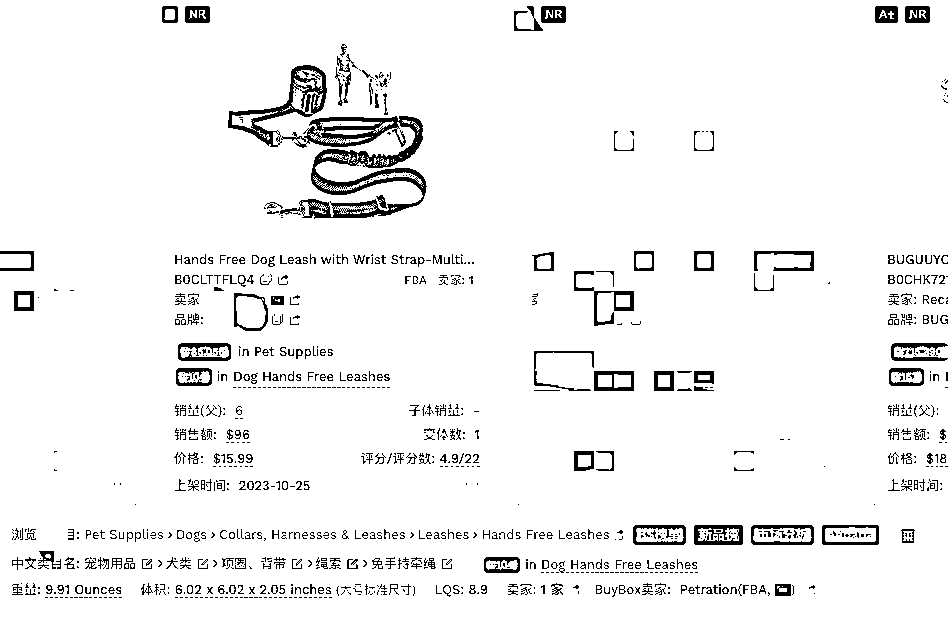

# 找到好赛道的重要性：即使是亚马逊宠物赛道，隐藏着许多小机会

> 原文：[`www.yuque.com/for_lazy/xkrm14/og0zpaqt24u9ww9y`](https://www.yuque.com/for_lazy/xkrm14/og0zpaqt24u9ww9y)

作者： xiao.^☀

日期：2024-01-31

点赞数：**37**

* * *

正文：

找到一个好赛道多重要。。 即使是 这样的大市场，即使是现在很热门的宠物赛道。好像也还是有很多小的机会隐藏在其中。
比如图中这个狗用免手持牵绳，月销量不到 10 居然也能在亚马逊宠物细分赛道的某个新品榜单，这完全是赛道找得好。。 这时候就会有种一切好容易的错觉
刚刚扒到一个说是爆款新品的列表，快 6k 条数据，狗狗这个就是从里面找出来的。
说是从各个大小新品榜里筛选出来的爆品，里面好多数据表现很小，也不知道是怎样进榜的赛道，是运气吗？还是眼光？有时候感觉是个玄学[`mjjl.cn/UkPb0J`](https://mjjl.cn/UkPb0J) 

* * *

评论区：

宫小鹿🦌 : 质疑玄学到相信玄学

xiao.^☀ : [可怜]那有什么办法呢，只能相信了

xiao.^☀ : 噗，本来只是碎碎念一下，突然变成风向标了哈哈好像有点 get 到生财玩法

* * *

公众号懒人搜索，懒人专属群分享