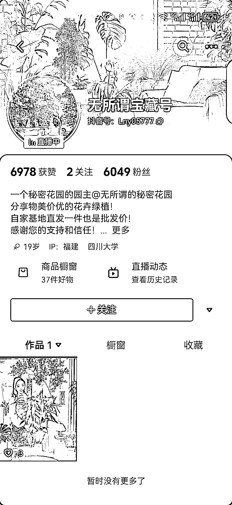
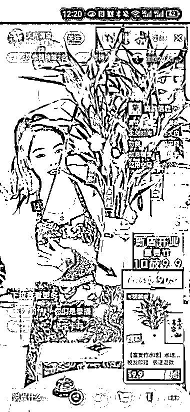
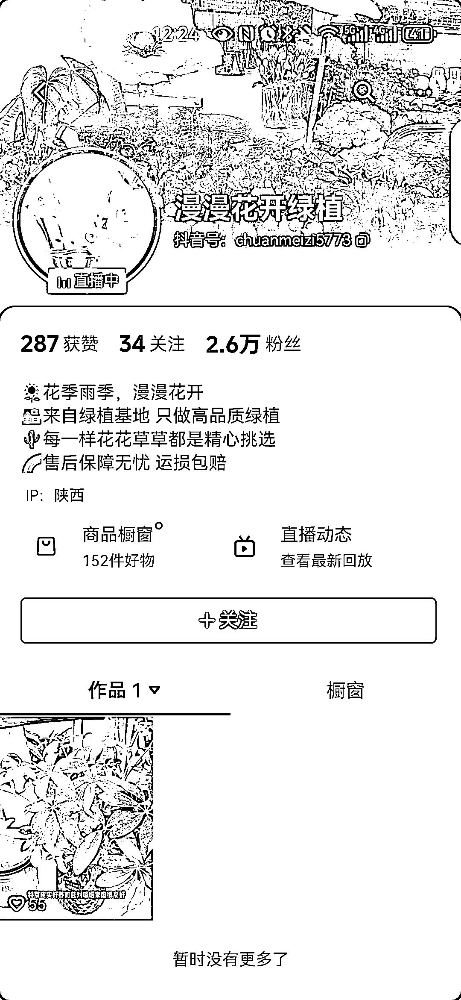
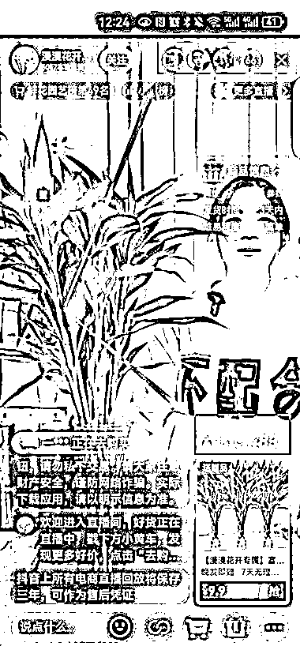
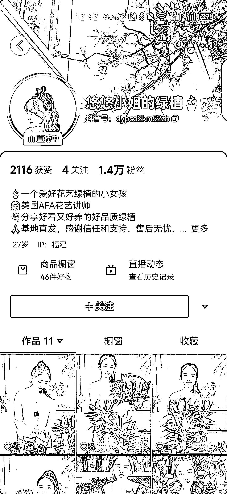
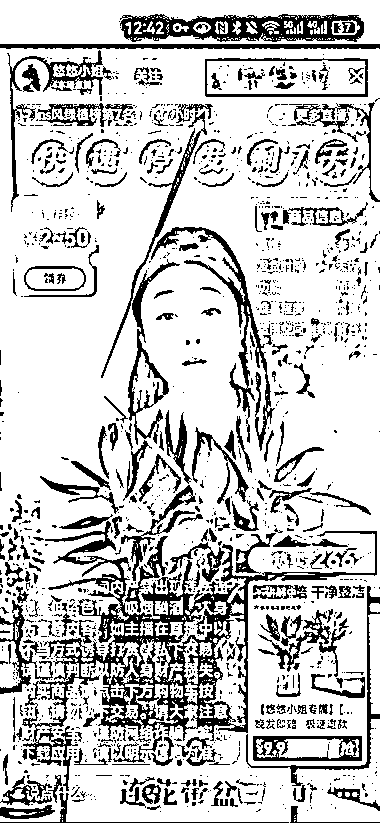
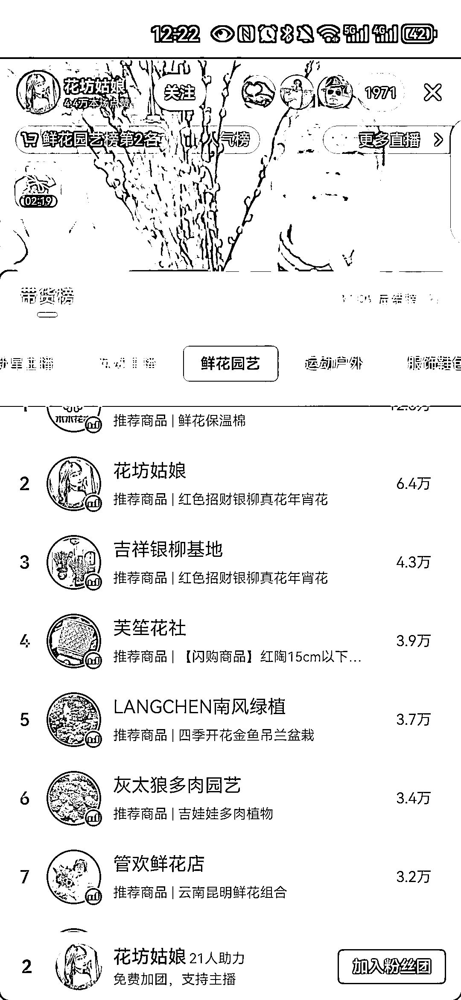

# 直播卖绿植，低粉高销量，蓝海行情

> 原文：[`www.yuque.com/for_lazy/xkrm14/nwys0sk2gdgnzch9`](https://www.yuque.com/for_lazy/xkrm14/nwys0sk2gdgnzch9)

作者： 希平

日期：2024-01-30

点赞数：**38**

* * *

正文：

直播卖绿植 今天刷抖音直播间，卖绿植的，好几个账号是低粉高销量（图 1 图 3 图 5）。
账号粉丝 5w 以内，发了几个短视频但获赞数 100 以内，也不挂车或评论区引导橱窗下单，说明销量不靠短视频。
在直播时，热销量＞场观，这是一个很异常的数值（图 2 图 4 图 6）。
随后我点击鲜花园艺榜单，除了第一名粉丝 10w 以上，其他的账号基本不过 10w（图 7），说明了这个行情属于蓝海。

* * *

评论区：

阿宇 : 这个热卖 可以刷的 只要待支付就可以了 不用付款就可以的

希平 : 但很多直播间都这样，说明有个普遍性

* * *

公众号懒人搜索，懒人专属群分享