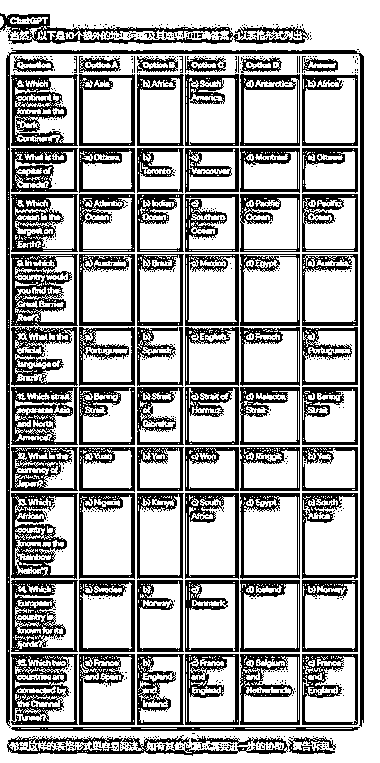
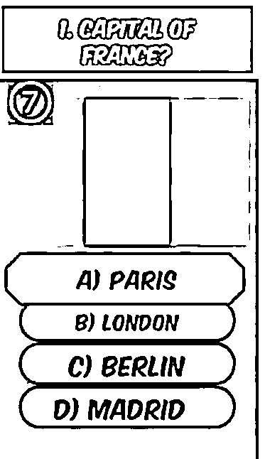

# 使用 GPT 和 Canva 批量生成地理类问答视频，确保内容准确性

> 原文：[`www.yuque.com/for_lazy/xkrm14/qk4ttpm94e1xszge`](https://www.yuque.com/for_lazy/xkrm14/qk4ttpm94e1xszge)

作者： 锦柏

日期：2024-01-29

点赞数：**37**

* * *

正文：

利用 GPT+canva 批量生成地理类问答视频，操作半个小时至少可生成 100 个，当然要检查 GPT 生成的内容是否正确，可应用于 TIKtok 中

* * *

评论区：

* * *

公众号懒人搜索，懒人专属群分享