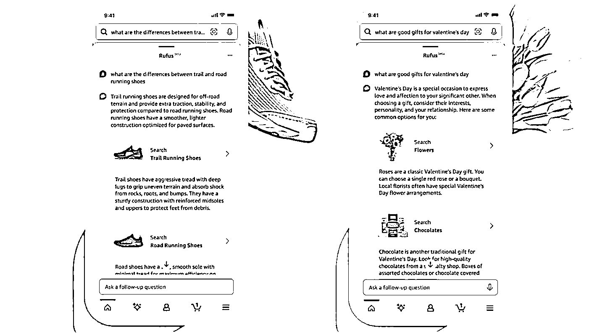

# 亚马逊推出 AI 购物助手 Rufus，提供商品信息和建议

> 原文：[`www.yuque.com/for_lazy/xkrm14/npm5bygk9scqw35z`](https://www.yuque.com/for_lazy/xkrm14/npm5bygk9scqw35z)

作者： Aimmon

日期：2024-02-02

点赞数：**51**

* * *

正文：

亚马逊推出 AI 购物助手 Rufus，可回答商品信息、提出建议等 2 月 2 日消息，亚马逊推出了一款新的生成式 AI 工具，帮助改善客户的购物体验。 该
AI 助手被命名为 Rufus，定位是一名专业的购物助理，可以回答问题、提出建议并提供商品比较，引导客户完成在线购物之旅。 [亚马逊推出 AI 购物助手
Rufus，可回答商品信息、提出建议等 - IT 之家](https://www.ithome.com/0/748/591.htm)

* * *

评论区：

* * *

公众号懒人搜索，懒人专属群分享