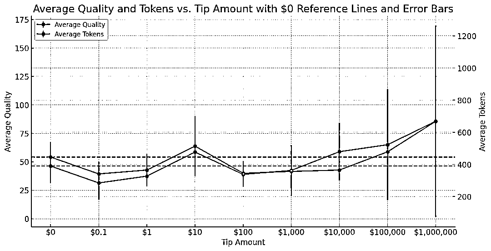

# 小费金额对 ChatGPT 的影响：10 美元的性价比最高

> 原文：[`www.yuque.com/for_lazy/xkrm14/gt0ndcaywgn7v6ex`](https://www.yuque.com/for_lazy/xkrm14/gt0ndcaywgn7v6ex)

作者： hulei

日期：2024-02-04

点赞数：**61**

* * *

正文：

ChatGPT 偷懒？假装给点小费就好 最近 Christian Mayer 博士利用 OpenAI API 和 GPT-4 Turbo
模型对这个传闻进行了实验。他设计了一系列提示，每个提示中包含不同的小费激励，范围从零到一百万美元不等。
测试结果表明，小额打赏可能会带来明显的积极影响，但打赏的金额似乎也很关键。 1️⃣ 0.1 美元效果最差 2️⃣ 10 美元性价比最高 3️⃣ 10
万-100 万美元之间，钱越多效果越好

* * *

评论区：

胡二虎🐯 : 今天开始，给小费都不行了。要装成残疾人，让他帮助你

晴天哥哥 : 所以我一直说「我没有手指」哈哈哈哈

倪大胖 : 哈哈哈 绝了

倪大胖 : 那他怎么理解你可以输入给他

* * *

公众号懒人搜索，懒人专属群分享