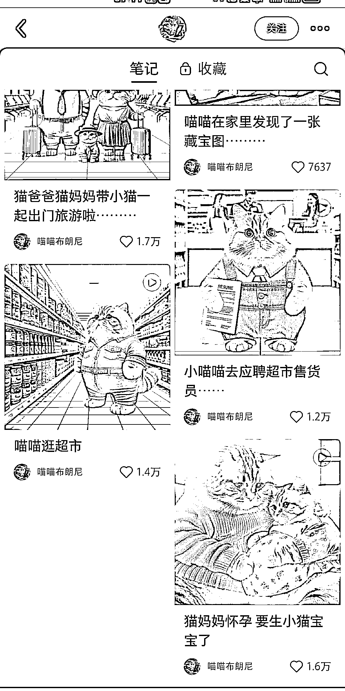
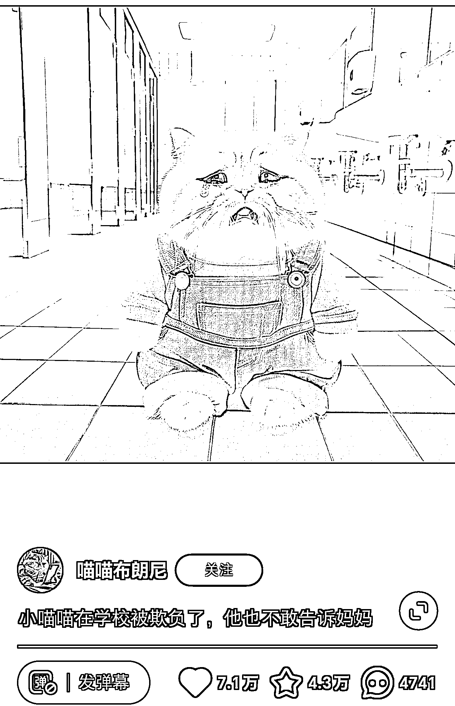

# 小红书 AI 绘画新号，以猫为主题的绘本视频走红，点赞量高达 7w 赞

> 原文：[`www.yuque.com/for_lazy/xkrm14/cx1fuiag54p7ndpd`](https://www.yuque.com/for_lazy/xkrm14/cx1fuiag54p7ndpd)

作者： 重瞳

日期：2024-02-05

点赞数：**97**

* * *

正文：

小红书 AI 绘画新号，1 月 24 日起号，作为均为以猫为主题的绘本视频，除了这两天发的新视频和广告外，条条是爆款，点赞量在 7k 赞到 7w 赞。 大体思路是使用
Midjourney 保持风格绘画连续出图，每个视频都讲了一个小故事。 今天开始图文带货了，带猫粮的广告。

* * *

评论区：

阿甜相信光 : 这账号在视频号也很火，也刷到他了，每个故事很有创意，每条 bgm 都是一样的喵喵~

重瞳 : 评论区也很有趣

Dreamland : 哇哦，变现效果咋样呀！我倒是会用 mj 做这种猫猫的图

花蝴蝶 : 这个是 GPT4 画的吧

Kerry : 我去小红书看了一下，另外一个同类型的号“一只狸花猫”的视频点赞数就很低，很多不超过 100 个，可以分析一下两者为什么差距这么大吗？

重瞳 : 我搜了一下叫这个名字的太多了，或许你可以把链接🔗贴上

Kerry : [喵喵侦探大显身手！](https://www.xiaohongshu.com/discovery/item/65be1eb5000000002c034a6a?app_platform=android&app_version=8.24.3&author_share=1&ignoreEngage=true&share_from_user_hidden=true&type=video&xhsshare=WeixinSession&appuid=62024eaa0000000010006925&apptime=1707262123) 

* * *

公众号懒人搜索，懒人专属群分享