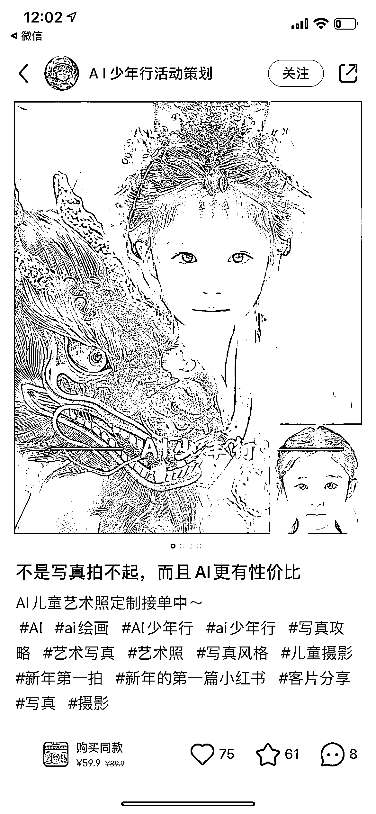
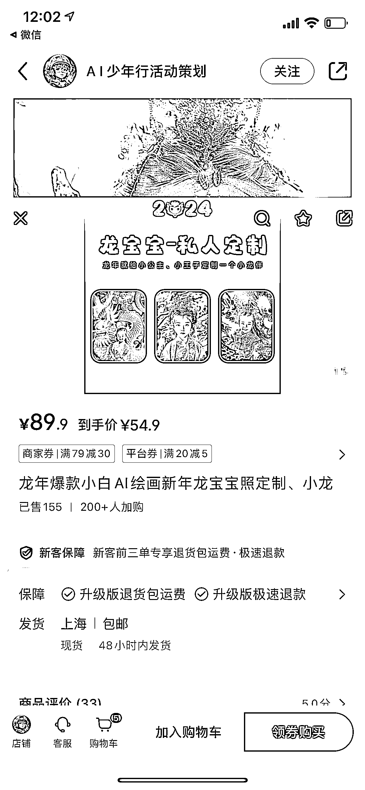
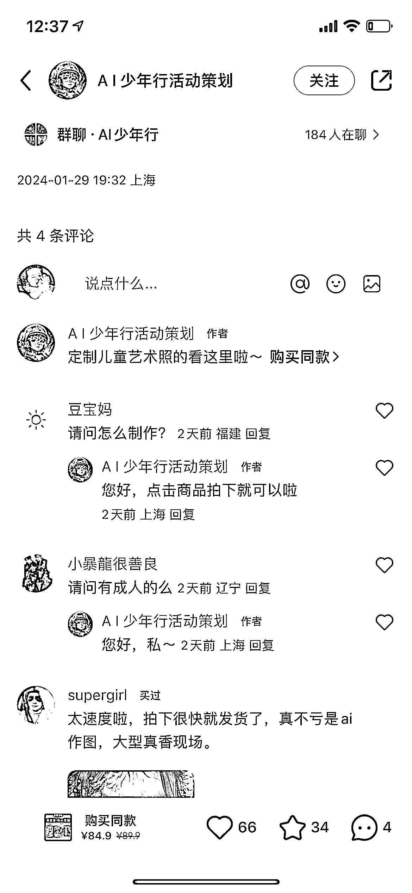

# AI 写真定制：震撼人心的精致绘画，离变现不远了！

> 原文：[`www.yuque.com/for_lazy/xkrm14/kh66d1z73otb5ha8`](https://www.yuque.com/for_lazy/xkrm14/kh66d1z73otb5ha8)

作者： Angie•三三

日期：2024-02-05

点赞数：**73**

* * *

正文：

在小红书刷到的 AI 写真定制，这个账号做的作品可以和真人摄影一争高下，非常自然精致。震惊，AI 绘画能做到这个程度那离变现不要太近了！这个商品链接看评论估计上线半个月左右，已售 155，图片效果这么好在私域做也可以有很好的转化。这个博主还出 99 元教做写真图的课程，目前课程卖的还不是很好。

* * *

评论区：

花满楼 : 这个是怎么做的

Angie•三三 : AI 绘画我不会，盲猜这是用 SD 做的。

Angie•三三 : 年关一天一个价，今天写真到手价是 84.9 了。不过教程还是 99，我猜作图可能比较费时，产出效率不如教人快。

Dreamland : 我倒是会 stable diffusion

Dreamland : 这个主要是看换脸，还是定制个模型

微微星光 : 说实话我看了都心动 不用尴尬的拍照

派大星 : 这里有个技术贴能看 [`ry5hwpuf7b.feishu.cn/docx/Ox2ndRADWojFdxxw...`](https://ry5hwpuf7b.feishu.cn/docx/Ox2ndRADWojFdxxwYQZcYKVbnVc?from=from_copylink) 

* * *

公众号懒人搜索，懒人专属群分享